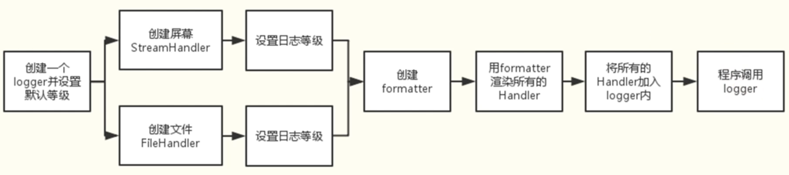

# logging
> python的日志模块
> 学习笔记：
> 【Python基础之标准库logging 你还在用print来调试程序吗，OUT啦】 https://www.bilibili.com/video/BV1sK4y1x7e1/?share_source=copy_web&vd_source=12b0148a2eaf69b7ba657e5937c9e0a6

## 基础概念
日志的级别：
- debug
- info
- warning
- error
- critical

默认的日志输出级别为warning,使用basicConfig(),level指定日志输出级别

默认在控制台打印信息，使用basicConfig(),filename指定日志文件

默认在文件中使用的是追加模式，basicConfig(),filemode可更改模式

logging是在单独线程中运行的，和print的先后顺序不一致

format参数可以自定义日志的格式，%(内容)s，内容可以有：
- asctime 时间
- levelname 级别
- filename 文件名
- lineno 行号
- message 信息

## 高级应用
- Loggers 记录器，提供应用程序代码能直接使用的接口
- Handlers 处理器，将记录器产生的日志发送到目的地（一个记录器可以有多个处理器）
- Filters 过滤器，提供更好的粒度控制，决定那些日志会被输出
- Formatters 格式化器，设置日志内容的组成结构和消息字段



### loggers 记录器
1. 提供应用程序的调用接口(相当于创建一支笔)
```python
logger=logging.getLogger(name)
```
logger是单例的
2. 决定日志记录的级别
```python
logger.setLevel()
```
3. 将日志内容传递到相关联的handlers中(笔和处理器的绑定)
```python
logger.addHandler()
logger.removeHandler()
```

### Handlers 处理器
将日志分发到不同的目的地，可以是文件、标准输出、邮件、或者通过socket、http协议发送到任何地方

- StreamHandler
标准输出(显示器)分发器
```
sh=logging.StreamHandler(stream=None)
```
- FileHandler
将日志保存到磁盘文件的处理器
```
fh=logging.FileHandler(filename,mode='a',encoding=None,delay=False)
```

```python
setFormatter() #设置当前handler对象使用的消息格式
```

handler还有很多类型
### Formatter 格式器
用来最终设置日志信息的顺序、结构和内容

```python
ft=logging.Formatter(fmt=None,datefmt=None,style=' %')
```
datefmt默认为 `%Y-%m-%D %H:%M:%S`
style参数默认为百分符`$`,这表示`%(<dictionary key>)s`格式的字符串

> 个人理解，上面三者分别控制着：谁来写？写到哪？怎么写？

1. 创建记录器，处理器和格式器
2. 为处理器设置格式
3. 为记录器添加处理器
4. 打印日志(通过记录器)

还可以通过配置文件来指定以上信息 