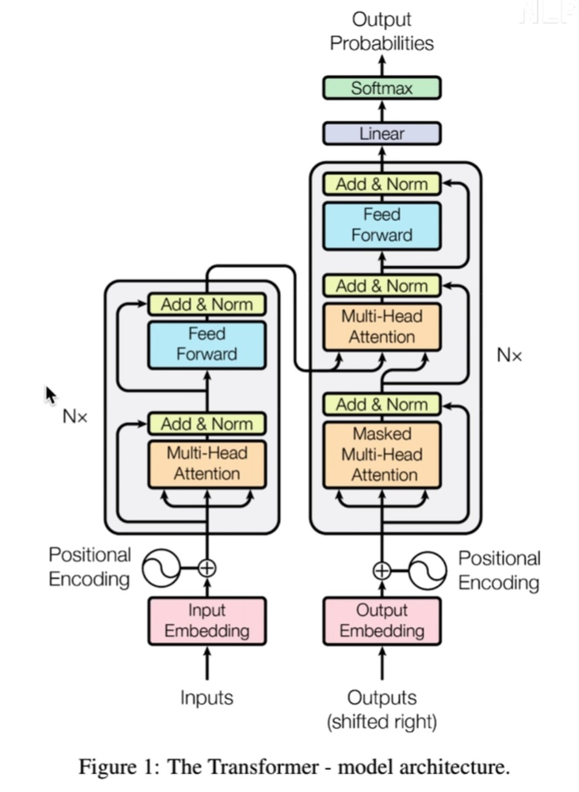

## 数据输入
输入X，一个向量矩阵

## 位置编码
偶数位置sin，奇数位置cos

## 注意力机制

$$
Z=Attention(Q,K,V)=softmax(\frac{QK^T}{\sqrt{d_k}})V
$$

$Q=X \times W^Q$，
$K=X \times W^K$，
$V=X \times W^V$
重复操作可得到多组 $Q，K，V$

## 残差和LayNorm
将Z与X相加

BatchNorm是一个批量中所有样本在相同维度做归一化，batch小的时候效果差
LayerNorm单独对一个样本的所有单词缩放
## Decoder
mask,将当前的词汇之后的词汇隐藏掉

encoder生成K,V矩阵，decoder输入Q矩阵

## pytorch实现
