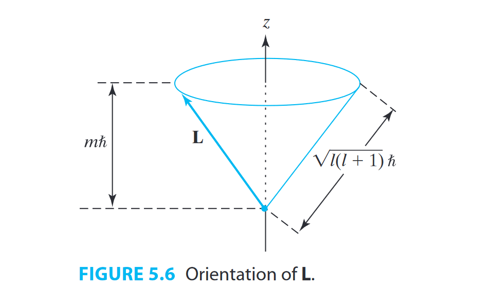

> 《Quantum Chemistry》学习笔记

## 好奇宝宝
- 什么是产生和湮灭算符？
- 费米规则？反对易关系？
- 狄拉克符号
- Hatree product
- 微扰理论
- truncated matrix
- 广义梯度近似
- 拉格朗日乘数法

## 常用latex符号
|符号|latex|常用含义|
|---|---|---|
|$\chi$|\chi|自旋轨道|
|$\delta$|\delta|迪拉克符号，0或1|
|$\epsilon$|\epsilon |能量|
|$\mu$|\mu|`spin-orbital`|
|$\phi$|\phi|`SCF atomic orbital`|
|$\Phi$|\Phi|`many-electron function`、`configuration state function`|
|$\psi$|\psi|空间轨道|
|$\Psi$|\Psi|
|$\theta$|\theta|`spatial orbital`|
|$\varphi$|\varphi|
|$\zeta$|\zeta|Slater指数|

## 知名人士
- `Roothaan` equations
- `Pople-Nesbet` equations
- `Koopmans`' theorem

## notations
> 书中提到了很多notation，这里总结一下

- bar notation 
就是在轨道上加个横线，代表自选相反的轨道 $\bar{\psi}$
$$
\langle mn||mn \rangle=\langle mn|mn \rangle-\langle mn|nm \rangle
$$

## 1. The schrodinger equation
### 微积分公式
$$
\frac{dc}{dx}=0
\quad\frac{d(cf)}{dx}=c\frac{df}{dx}
\quad\frac{dx^n}{dx}=nx^{n-1}
\quad\frac{de^{cx}}{dx}=ce^{cx}
$$
---
$$
\frac{d(\sin cx)}{dx}=c\cos cx,\quad\frac{d(\cos cx)}{dx}=-c\sin cx,\quad\frac{d\ln cx}{dx}=\frac{1}{x}
$$
---
$$
\frac{d(f+g)}{dx}=\frac{df}{dx}+\frac{dg}{dx},\quad\frac{d(fg)}{dx}=f\frac{dg}{dx}+g\frac{df}{dx}
$$
---
$$
\begin{aligned}\frac{d(f/g)}{dx}=\frac{d(fg^{-1})}{dx}=-fg^{-2}\frac{dg}{dx}+g^{-1}\frac{df}{dx}\end{aligned}
$$
---
$$
\frac d{dx}f(g(x))=\frac{df}{dg}\frac{dg}{dx}
$$
---
$$
\int cf(x)dx=c\int f(x)dx,\quad\int\bigl[f(x)+g(x)\bigr]dx=\int f(x)dx+\int g(x)dx
$$
---
$$
\begin{aligned}\int dx=x,\quad\int x^ndx=\frac{x^{n+1}}{n+1}\quad\mathrm{for}n\neq-1,\quad\int\frac{1}{x}dx=\ln x\end{aligned}
$$
---
$$
\begin{aligned}\int e^{cx}dx=\frac{e^{cx}}{c},\quad\int\sin cxdx=-\frac{\cos cx}{c},\quad\int\cos cxdx=\frac{\sin cx}{c}\end{aligned}
$$
---
$$
\int_b^cf(x)dx=g(c)-g(b)\quad\mathrm{~where~}\frac{dg}{dx}=f(x)
$$

$$
\cos\alpha +i\sin\alpha = 1
$$

## 3. Operator
An operator is a rule that transforms a given function into another function.

$$
(\hat{A}+\hat{B})f(x)\equiv\hat{A}f(x)+\hat{B}f(x)
$$

$$
\hat{A}\hat{B}f(x)\equiv\hat{A}[\hat{B}f(x)]
$$

The operators $\hat{A}\hat{B}$ and $\hat{B}\hat{A}$ may not have the same effect.

We can develop an operator algebra as follows. Two operators An and Bn are said to be equal if $\hat{A}f$ = $\hat{A}f$ for all functions $f$.

We define the **commutator**:
$$
[\hat{A},\hat{B}]\equiv\hat{A}\hat{B}-\hat{B}\hat{A}
$$

It turns out that the operators occurring in quantum mechanics are linear.$\hat{A}$ is a **linear operator** if and only if it has the following two properties:

$$
\hat{A}[f(x)+g(x)]=\hat{A}f(x)+\hat{A}g(x)
$$

$$
\hat{A}[cf(x)]=c\hat{A}f(x)
$$

$$
(\hat{A}+\hat{B})\hat{C}=\hat{A}\hat{C}+\hat{B}\hat{C}
$$

$$
\hat{A}(\hat{B}+\hat{C})=\hat{A}\hat{B}+\hat{A}\hat{C}
$$

$f(x)$ is an eigenfunction of $\hat{A}$ with eigenvalue $k$.

$$
\hat{A}f(x)=kf(x)
$$

**Laplacian operator:**
$$
\nabla^2\equiv\frac{\partial^2}{\partial x^2}+\frac{\partial^2}{\partial y^2}+\frac{\partial^2}{\partial z^2} \tag{3.36}
$$

When two or more indepent wave functions correspond to states with the same energy eigenvalue, the eigenvalue is said to be **degenerate**.
The **degree of degeneracy** (or, simply, the **degeneracy**) of an energy level is the number of states that have that energy.

every linear combination of the wave functions of degenerate level with energy eigenvalue w is an eigenfunction of the Hamiltonian operator with eigenvalue w.

no member of a set of linearly independent functions can be express as a linear combination of a set of the remaining members.

average value = expection value
$$
\left \langle B \right \rangle =\int \Psi ^*\hat{B}\Psi \ d\tau  \tag{3.88}
$$

对易：$[A,B]=AB-BA=0$；
反对易：${A,B}=AB+BA$

产生算符$a_i^+$就是在轨道中增加一个电子，行列式增加一项
湮灭算符$a_i$就是在轨道中减去一个电子，两者是伴随关系，即$(a_i^+)^+=a_i$，两者之间是反对易的
阶梯算符，$s_+，s_-$
## 4. The Harmonic Oscillator
dummy variable 一些无关紧要的下标,使用什么字母都可以，类似于循环中的指标？

对于$y''+c^2y=0$，解为$Acos\ cx+Bsin\ cx$

vibration frequency:
$$
\nu=\frac{1}{2\pi}\left ( \frac{k}{m}  \right )^{1/2}
$$

力与势能
$$
F_x=-\frac{\partial V}{\partial x}=-kx
$$

$$
E=(\upsilon+\frac{1}{2})h\nu,\ \ \upsilon=0,1,2,...
$$

The harmonic-oscillator ground-state energy is nonezero. The energy, $\frac{1}{2}h\nu$, is called the **zero point energy**

The quality $m_1m_2/(m_1+m_2)$ is called the **reduce mass** $\mu$.

Differences in nuclear mass have virtually no effect on the electronic-energy curve U(R), so different isotopic species of the same molecule have essentially the same force constant k.

$$
E_{vib}\approx(\upsilon+\frac{1}{2})h\nu_e,\ \upsilon=0,1,2,...
$$

$$
\nu_e=\frac{1}{2\pi}\left ( \frac{k}{\mu }  \right ) ^{1/2}
$$

wavenumber
$$
\hat{\nu}=1/\lambda=\nu/c
$$

## 5. Angular Momentum
if $[\hat{A},\hat{B}]=0$, $\Psi$ can be both eigenfunction of both $\hat{A}$ and $\hat{B}$.

$$
[\hat{A},\hat{B}]=-[\hat{B},\hat{A}]
$$

$$
[\hat{A},\hat{A}^n]=0,\ \ n=1,2,3,...
$$

$$
[k\hat{A},\hat{B}]=[\hat{A},k\hat{B}]=k[\hat{A},\hat{B}]
$$

$$
[\hat{A},\hat{B}+\hat{C}]=[\hat{A},\hat{B}]+[\hat{A},\hat{C}]
$$

$$
[\hat{A}+\hat{B},\hat{C}]=[\hat{A},\hat{C}]+[\hat{B},\hat{C}]
$$

$$
[\hat{A},\hat{B}\hat{C}]=[\hat{A},\hat{B}]\hat{C}+\hat{B}[\hat{A},\hat{C}]
$$

$$
[\hat{A}\hat{B},\hat{C}]=[\hat{A},\hat{C}]\hat{B}+\hat{A}[\hat{B},\hat{C}]
$$

互相对易的算符对应的物理量可同时确定

$$
(\Delta A)^2=\left \langle A^2 \right \rangle -\left \langle A \right \rangle ^2
$$
时间没有算符。

To have a complete set of functions that are simulataneous eigenfunctions of several operators, each operator must commute with every other operator.

### Vectors
$$
A·B=|A||B|cos\theta=B·A
$$

$$
A.B=A_xB_x+A_yB_y+A_zB_z
$$

**cross product** or (vector product)
$$
|A\times B|=|A||B|sin\theta
$$
垂直于AB所在的平面（右手系统）

$$
\mathbf{A}\times\mathbf{B}=\begin{vmatrix}\mathbf{i}&\mathbf{j}&\mathbf{k}\\A_x&A_y&A_z\\B_x&B_y&B_z\end{vmatrix}=\mathbf{i}\begin{vmatrix}A_y&A_z\\B_y&B_z\end{vmatrix}-\mathbf{j}\begin{vmatrix}A_x&A_z\\B_x&B_z\end{vmatrix}+\mathbf{k}\begin{vmatrix}A_x&A_y\\B_x&B_y\end{vmatrix}
$$

vector operator **del**:

$$
\nabla=\mathbf{i}\frac\partial{\partial x}+\mathbf{j}\frac\partial{\partial y}+\mathbf{k}\frac\partial{\partial z}
$$

the linear-momentum vector is $\begin{aligned}\hat{\mathbf{p}}&=-i\hbar\nabla\end{aligned}$

the **gradient** of function *g* is defined as the result of operating on *g* with del.

**classical mechanics of one-particle angular momentum**

linear momentum vector **p**:
$$
\mathbf{p} \equiv m\mathbf{v}
$$
angular momentum **L**:
$$
\mathbf{L} \equiv \mathbf{r}\times  \mathbf{p}
$$
perpendicular to the plane defined by the particle's position vector **r** and its velocity **v**.

In quantum mechanics, there are two kinds of angular momenta. **Orbital angular	momentum** results from the motion of a particle through space, and is the analog of the classical-mechanical quantity **L**. **Spin angular momentum** is an intrinsic property of many microscopic particles and has no classical-mechanical analog.

$$
[\hat{L}^2,\hat{L}_x]=0
$$
In quantum mechanics when angular momentum is conserved, only its magnitude and one of its components are specifiable.

$$
\hat{L}_z=-i\hbar \frac{\partial}{\partial \phi}
$$

The magnitude of the orbital angular momentum of a particle is:
$$
|L|=[l(l+1)]^{1/2}\hbar
$$
$$
m=-l,...,l
$$

the $\hat{L}^2$ and $\hat{L}_z$ genfunctions
$$
Y_l^m(\theta,\phi)=S_{l,m}(\theta)T(\phi)=\frac{1}{\sqrt{2\pi}}S_{l,m}e^{im\psi}
$$
The $l$ in $Y_l^m$ is a label, and not an exponent.

the one-particle orbital angular-momentum eigenfunctions and eigenvalues are:

$$
\hat{L}_zY(\theta,\phi)=bY(\theta,\phi)
\\
\hat{L}^2Y(\theta,\phi)=bY(\theta,\phi)
\\
b=m\hbar, m=...-2,-1,0,1,2...
\\
c=l(l+1)\hbar^2, l=0,1,2...
$$

阶梯算符（上升算符$\hat{M}_+$和下降算符$\hat{M}_-$）可以让本征值上升或下降$\hbar$

---

自旋平行的轨道才有交换积分

只有$\alpha$和$\beta$轨道之间才有重叠矩阵，对于闭壳层，$\alpha$和$\beta$是在一块的，索引任意两个轨道之间都有重叠

HF计算的空轨道的能量总是负的，但是有时候中性原子变为负离子会提高稳定性

核心哈密顿是指单电子积分，描述了电子的动能和势能。

$$
\phi_{1s}^{GF}(\alpha,r-R_A)=(2\alpha/\pi)^{3/4}e^{-\alpha|r-R_A|^2}
$$
最简单的高斯积分：
$$
\int_{-\infty }^{\infty }e^{-ax^2}=\sqrt{\frac{\pi}{a} } 
$$

If one stretches any bond for which the correct products of dissociation must be represented by open-shell wave functions, then restricted closed­ shell calculations must necessarily give the wrong limit.

量子数用来描述状态

总轨道角动量用大写字母，单个电子的轨道角动量用小写字母

$L$：`total electronic orbital angular momentum`

$S$：`total electronic spin angular momentum`

什么是 `zeroth order function`

$2S+1$ `electron-spin multiplicity`

量化中的 term 基项？ levels

atomic term可以分为很多level

electron configuration

相同自选之间才有交换积分K（$\alpha$或$\beta$）

交换积分一般比库伦积分小的多