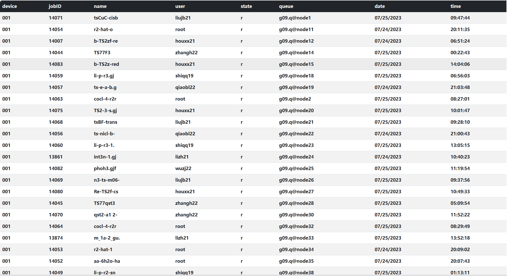

# 随时查看作业状态

> 今天在服务器（一号机）交作业的时候，想一边等作业完成一边学习，但是有一点很不爽的是，我需要每次执行命令才能查看作业的最新状态，这需要分散我的一点点注意力，因此想做一个自动刷新的程序

想着我还有个网站，干脆就做个前端的项目吧。

首先要在一号机上运行一个能持续向服务器（阿里云）发送数据的脚本，内容很简单，用os调用`qstat -u \*`获取输出，然后一股脑扔给阿里云（毕竟是大家都在用的机器，我可不敢占用太多资源😰）。

然后，在服务器上写两个接口，分别是接收数据（set）和发送数据（get），数据需要经过一些处理，简单来说要分为三部分：
1. 新的数据 （一号机向阿里云发送的数据）
2. 临时数据 （服务运行时的一个字典对象）
3. 永久数据 （计算完的数据保存到数据库）

最后，用vue编写一个前端页面，很简单，只需要用ajax向后台请求数据（一分钟请求一次）然后在页面显示即可，顺便用bootstrap美化一下，然后就能通过浏览器看自己的作业状态啦！😄

最终界面如下：
