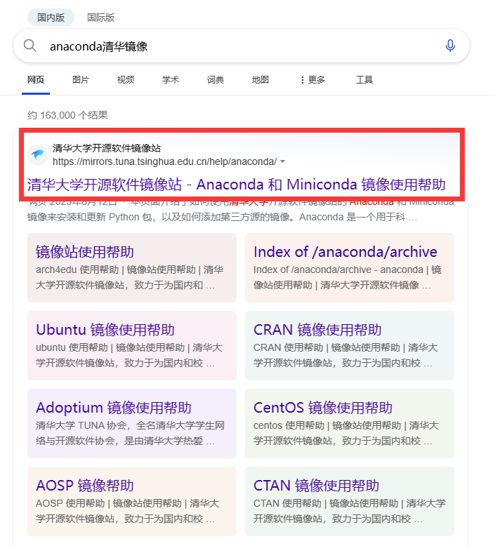
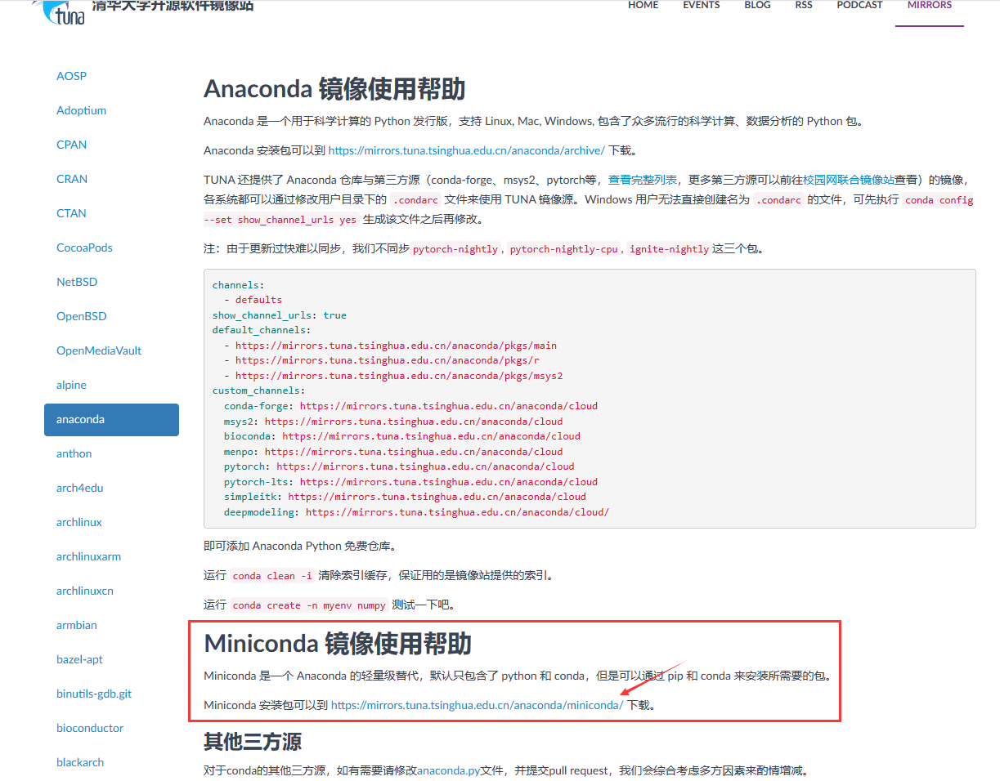
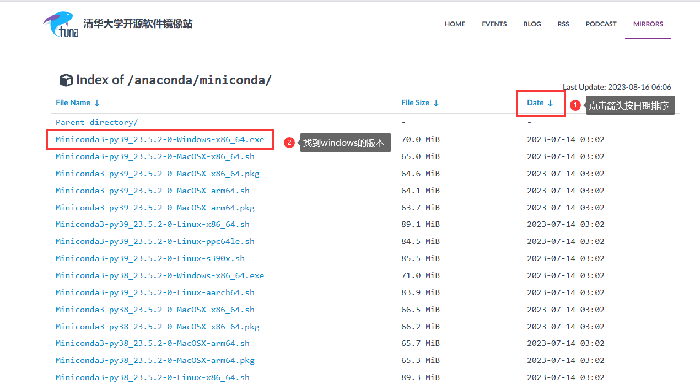
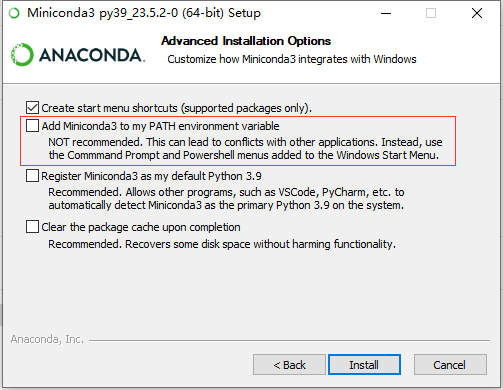
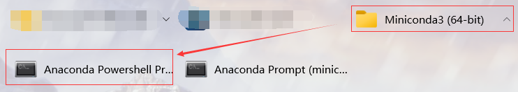
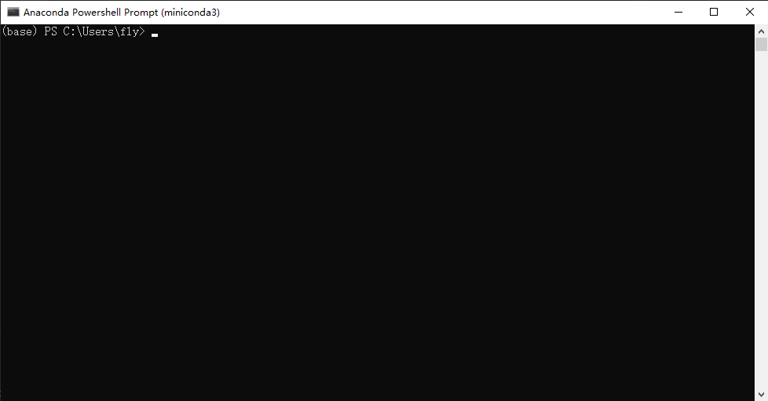

# 安装python环境
> python在学习工作中使用的很多，但很多朋友对这方面并不懂，因此写一个手把手的python环境安装教程

## 下载安装包
虽然下载官网的python肯定是最轻便的，但是官网速度较慢，而且安装第三方库时使用的不是国内镜像，速度很慢，因此我推荐使用miniconda的清华镜像

1. 浏览器搜索`anaconda清华镜像`

画红框的这个就是官网，千万不要进入了什么杂七杂八的网站了呦
2. 找到`miniconda`界面

1. 下载最新的适合于windows的安装包

## 安装miniconda
下载安装包完成后，双击运行安装包，一路按照默认设置即可

> 对于是否要将python添加到环境变量，一般情况下时没问题的，可以方便地在cmd或者terminal中调用。但是对于电脑上已经存在python环境的情况下，可能会把原先的给顶掉，因此我推荐，如果只是使用python运行一些脚本的话，这一项不用选，使用自带的anacondaPrompt即可，如果想自己写脚本地话还是点上去地比较好。（当然添加环境变量在安装完成后也可以自己手动折腾）

## 运行
安装完成后，在开始中的Miniconda3中可以找到`Anaconda Powershell Prompt`

点击运行看到这个黑乎乎的窗口就行了
