**Optimization of parameters for semiempirical methods VI: more modifications to the NDDO approximations and re-optimization of parameters**

半经验方法参数的拟合，对NDDO方法的改进
## 1 介绍

半经验方法：部分量子理论+部分经验方法，最常见的是NDDO，别的方法都是对该方法的改进

每种新方法都有不同的改进,但也会产生新的误差

用PM6举例说明：Si-O-H被错误计算成线性，但PM3没这个问题。

本文讨论PM6错误的原因

## 2 PM6中的错误

- 忽略了一些特定原子对之间的排斥
- 模拟晶体结构后发现在固体上的误差很大

## 3 理论
### 3.1 对NDDO的进一步修正

#### 3.1.1 对核-核作用的约束

NDDO中有一个约束条件：随着原子间距离的增加，核-核相互作用会逐渐收敛到精确值（有误差），但该约束对固体来说不够用（重复结构会放大误差）

通过替换双电子积分<ss|pp>（$γ_{AB}$）（公式1和图1）满足了一下三个要求：

- 离散体系的变化要小；
- 消除固体中的叠加误差；
- 确保真实的物理行为。

#### 3.1.2 对电子-电子排斥积分值的约束

中性原子之间不应该有净吸引或排斥。（保持电子-电子、电子-原子、原子-原子之间的平衡）

第二个矫正是对于杂化轨道或孤对轨道对固体能量的虚假贡献。

修改后的积分随着距离的增加比原始 NDDO 积分收敛到零的速度更快。

#### 3.1.3 过渡金属p价层电子的能量

在过渡金属的参数优化过程中，当包含涉及 p 电子的表示原子能级的数据时遇到了问题。

正常情况下p很小，但一些金属元素，随着p数量增加，计算的生成热 (ΔHf) 变得不准确。

主要原因在于忽略微分重叠。训练没考虑到过渡金属p轨道扩散（作用范围大，误差积累）。

金属中不能存在离子键特征（在其他体系中很常见）

考虑重叠的话会降低能量，但没有考虑。

涉及p和d电子都参与化学键的原子的化学系统的数量很少。
#### 3.1.4 添加色散和氢键

MNDO在范德华吸引和氢键作用上误差很大，后来的许多方法都想要减小着这个误差。

半经验方法适用的生物体系有很多分子间相互作用。

添加色散和氢键矫正项。两个单独的能量之和减去在一起的能量。Hobza’s databases。

PM6-DH 中的氢键项特别简单，仅取决于原子间距离、角度以及所涉及的氢和受体原子的部分电荷。

PM6-DH2 中氢键能项被扩展到包括一些扭转角。 都降低了误差。

半经验方法要能够优化几何结构（原子力）。

当存在自洽场时，系统的能量非常低（变分原理的重述），因此电子分布的一阶导数关于到几何必须恰好为零。

氢键时电子分布的函数，电子分布是由SCF计算得到的，氢键改变了能量但不影响电子分布，能量不能再降低（可以通过改变电子分布）。

能量和力最低点不重合，导致几何形状不正确。因此氢键相互作用的能量必须独立于分数原子电荷。

PM6-DH+ 该方法仅取决于系统的几何形状，而不取决于电荷分布。

该方法处理简单的线性氢键时会失败，氢键函数不连续（存在尖点）。

前几个对PM6的矫正都被考虑在PM7中。公式2。

色散对于固体还是有问题。

PM7添加阻尼函数矫正强短程相互作用。公式3，图2。

PM6-DH和PM6-DH+都是为了矫正分子间相互作用，但ΔHf计算的更不准，PM7着重于解决该问题。

离散物没有问题

#### 3.1.5 减少参数数量

NDDO中只用了几十种化合物，每种元素7个参数。
PM6方法使用了几千种化合物，参数数量急剧增加。

参数空间变大，很难找到最小值。违反奥卡姆剃刀原理（不做不必要假设，越简单越好）

MNDO没有考虑Π堆叠和氢键，因此将核-核高斯函数添加到PM3和PM6中。（导致参数增加）

MP7中删除了H、C、N、O之外的核-核高斯函数，减少参数量。

#### 3.1.6 修改以允许UHF部分开壳
限制性应用域固体需要考虑组态相互作用，很昂贵。

使用UHF可以避免（能量很小因此可忽略）

半电子方法

### 3.2 重现势垒高度的特定参数化
AM1、PM3和PM6在重现反应能垒时准确度较低。有以下可能原因：

- 半经验方法使用受限基组会妨碍同时模拟基态和过渡态；
- HOMO-LUMO 间隙降低，过渡态区域可能会出现细微电子现象；
- 参数化训练集中几乎没有过渡态系统。

为了提高预测能垒的准确性，尝试特定参数化。

### 3.3 参考数据
#### 3.3.1 参考数据的性质和结构 以及 参数空间
使用了几种常用的参考数据：生成热、几何结构、偶极矩、电离势。需要无量纲化。

参数空间是一个维度等于参数数量的空间。一些数据对参数向量求导可以得到另一些数据。

相似化合物的相同数据的向量夹角很小。

参数空间中任何方向的运动都可以由参考数据向量的某种线性组合来表示。

*参数空间最小值的性质* 参数优化的目标是在参数空间表面上移动，以最小化误差函数的值。在参数空间的极小值处，参数空间的局部结构可以用参数的Hessian矩阵表示:
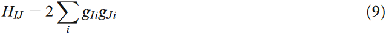

Hessian 的对角化产生一组特征值，这些特征值表示误差函数的力常数，它们的特征向量表示参数空间中相应的正常运动模式。

最小值要满足的两个条件：函数相对于所有变量（参数）的梯度必须为零，并且其所有特征值必须为零或正。

*参数Hessian的性质*  给定大小为 N 的 Hessian，如果恰好使用一个参考数据，则将有一个正特征值和 N−1 个恰好为零的特征值。

参数超曲面上的最小值成为真最小值的充分必要条件是关联的 Hessian 矩阵的所有特征值都必须为正。

参数 Hessian 中存在非常小或恰好为零的特征值违反了奥卡姆剃刀原则，因为它意味着参数数量过多。很难识别和删除导致特征值为零的参数，因为有问题的特征向量涉及的参数有很大贡献。

对参数 Hessian 的特征值和特征向量的分析提供了大量最小值性质的信息。它指出了参考数据的相关性及局限性，并指导如何对其改进。

#### 3.3.2 参考数据不足，无法进行广泛的化学分析
早期的数据是从发表实验数据中收集的。构建这些数据集很耗时间，限制了方法的开发。早期参数化一个元素都是一个很大的成就。但这些如今已经不是啥问题了。（数据库CSD及硬件的发展）
尚未解决的问题是收集足够的参考数据以允许定义所有双原子参数对。

CSD 包含超过 600,000 个小分子晶体结构，其中约一半适合用作参考数据。

ICSD:另一个大型存储库是无机晶体结构数据库 (ICSD)。不适用于生物体系。

离散物种主要是长程作用(2-4埃)，量子力学项随距离迅速减少，主要是静电和空间相互作用。涉及整个晶体的参数化计算量太大不切实际。
#### 3.3.3 使用**代理函数**来表示非共价相互作用
NDDO中的核-核相互作用：
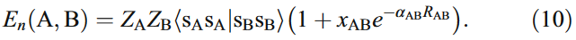

其中$x$和$\alpha$是参数。应用于晶体时结果不好，这个双原子函数很灵活，在用于模拟分子时很好，但在应用于固体时不好。

加入参考空间项可以完全纠正刚才描述的错误：
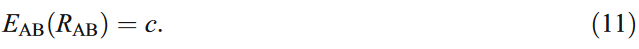

该公式更像是艺术而非科学，就叫晶体的代理函数。

对于大多数固体，增加空间作用项会导致原子间距增加，但排斥力增加会导致原子间距减小。这种矛盾仅存在纯元素固体中。
#### 3.3.4 PM7-TS的参考数据
能垒的参考数据仅从高精度计算获得。该工作的目的是提高对生物分子准确性，仅涉及简单有机键的形成和断裂。由于参考数据很少，所以增加一些PM7预测准的简单基态化合物。
#### 3.3.5 额外的约束
有几个元素没有足够的参考数据来定义参数空间的最小值，因此要生成额外的参考数据从而将参数限制为“合理”值。

最常见的约束类型涉及定义`孤立的高能原子和离子的能量`。

例如Ag加入$Ag^{3+}$激发态。

尽管这些数据没有化学意义，但发现它们对于定义参数空间中的最小值很重要。
### 3.4 参数优化
使用PM6的H,C,N,O作为初始参数去优化F,P,S,Cl,Br和I。

优化参数后，在固体中进行验证，再根据结果重新优化。

每个单独的参数优化速度都很快，但由于要重复多次，元素很多因此就慢了下来。
## 4 结果
表1和表2列出了各种化合物和固体的生成热中的平均无符号误差 (AUE)，表3和表4显示了几何形状中的AUE。

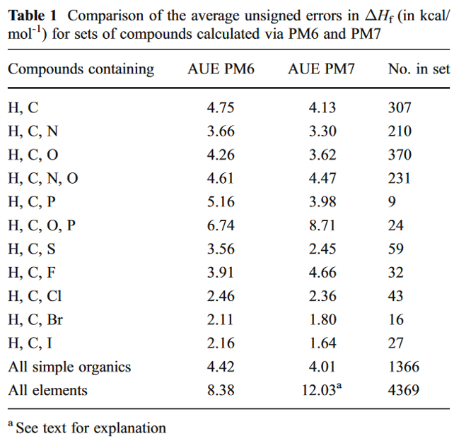
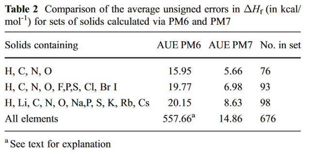
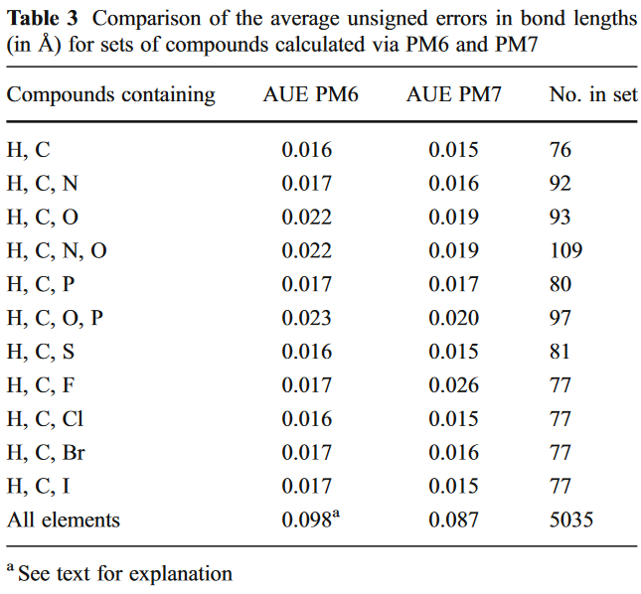
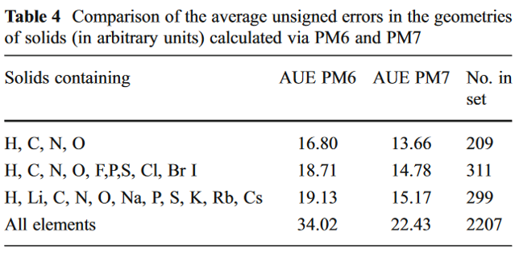

参考数据少时，代理函数会降低PM7预测的准确度。

PM7的很多参考数据不准确，主要是因为实验困难，特别是重元素多的物质，理论计算(DFT)与实验不相符。

一种方法是删除有问题的参考数据，但会无法确定任何`因此产生的方法的准确性`。

从PM6到PM7，偶极矩、电离电势的误差也增加了，可能是因为降低了对电子属性的重视，也有可能是使用代理函数的结果。
### 4.1 固体
结晶固体可以很好检验半经验方法模拟真实化学系统的能力。具有丰富的生成热以及X衍射的实验数据。与计算化学研究的气态物质不同，固体代表真实的化学物质。

固体具有非常广泛的化学环境，因此模拟起来很困难。固体为测试计算化学方法的准确性和预测能力提供了广泛的化学环境。

分别使用PM6和PM7对一组2194个固体密度进行预测，结果如图3和图4，PM7预测的更准确一些。

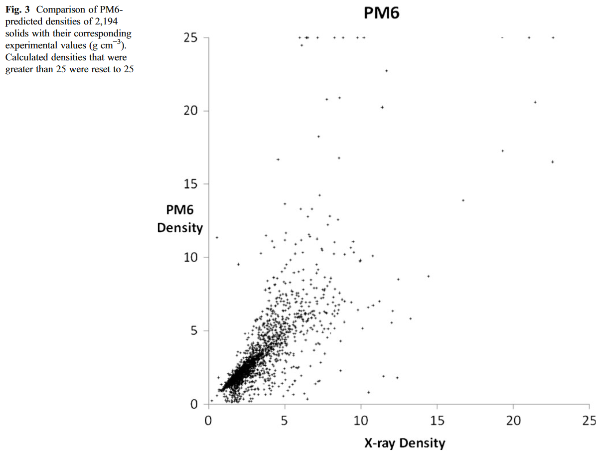
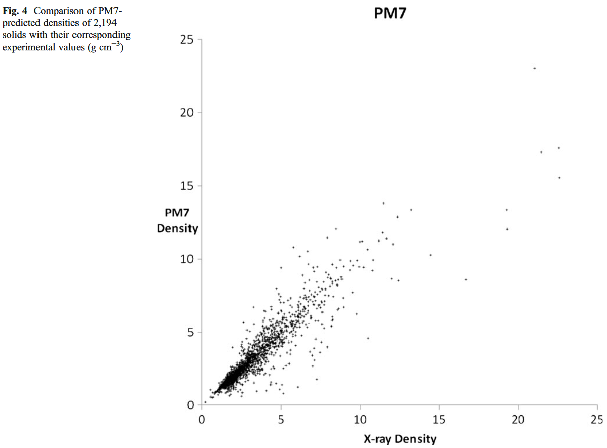

#### 4.1.1 有机化合物
大部分有机化合物由离散部分组成，很多只通过范德华力结合在一起，这一特性使其适用于测试方法，尤其是分子间相互作用程度。

PM7预测简单固体的结合形状以及生成热的表现比PM6好，最重要的原因是对分子间相互作用表示的改进。

#### 4.1.2 色散和氢键
有机化学以研究分子为主，分子间非共价相互作用的性质非常重要。从实验中获得准确的参考数据很困难，因此使用理论预测的结果。

已经开发了两个基准数据库S22和S66可用来测试计算方法。这些数据库包含高级的从头计算方法的结果，分子间相互作用能和几何结构。

PM7的误差大于PM6DH2和PM6-DH+的误差。但这三种方法的误差都不到B3LYP的一半。

PM6发布后，发现一个严重的错误：许多涉及卤素 Cl、Br 和 I 的非共价相互作用太强，而且它们的原子间距太短。后来通过向PM6方法添加后SCF校正来纠正此错误。在 PM7 的开发过程中也使用了相同的数据，这意味着PM7对于卤素中的大部分错误都得到了纠正。

#### 4.1.3 涉及氢和氧的离子
晶体中存在几种形式的质子化水络合物，而阴离子几乎总是以简单的氢氧根离子形式出现。

在对包含氢和氧离子的28种固体的测试中，PM7预测的27种几何形状的准确度高于PM6。

PM7重现了所有三种质子化水复合物的结构；而PM6不能。

#### 4.1.4 碳氢化合物
固体碳氢化合物是对纯色散相互作用的良好测试。结果如表8。

PM7比PM6精度更高的,可归因于 Jurečka 等人开发的色散项。
#### 4.1.5 其它强氢键
当一个质子与两个阴离子键合时，可以形成异常强的氢键，带有净负电荷。常出现在酸式盐和相关系统中。

氢原子在两个氧原子之间的位置是否对称，取决于微妙的能量平衡，因此提供了对氢键的灵敏测试。

PM6和PM7都正确预测了醋酸氢钠的对称结构，但只有PM7正确预测了醋酸氢钾的不对称结构。

图7中发现了另一种类型的强氢键。在固态下，该化合物在羧酸基团和咪唑环上的氮原子之间包含一个内部 N...H...O 氢键。当对固体建模时，会重现异常短的键，PM7 为 2.508 Å，PM6 为 2.517 Å。当对气相系统建模时，PM6 和 PM7 都预测 N-O 距离更接近于更常见的中性氢键中发现的距离，说明两性离子性质仅在 存在晶体环境的协同效应 时表现出来。

#### 4.1.6 卤素键
测试了涉及Cl、Br或I非共价键合到O、N或π系统的20种复合物的分子间相互作用的平均无符号误差为2.46 kcal/mol-1 (PM6)、1.63 (PM7) 和 0.76 (PM6-DH2X)。
原因：PM6-DH2X 中的`后校正`方法未在PM7中使用。

可以通过应用PM6-DH2X中使用的特定校正来减少误差。
#### 4.1.7 升华能
分子间相互作用的另一种衡量标准为实验测定的升华能；即化学物质在晶体和气相中的能量差异。

表9列出了计算的和实验确定的升华热的比较。PM7的AUE（5.0 kcal/mol-1）仍然不到 PM6（10.3 kcal/mol-1）的一半。六氯苯的升华热误差特别大。
#### 4.1.8 共晶能
通过比较计算的共晶及其前体的形成热来估计分子间相互作用能的预测准确性（表 10）。

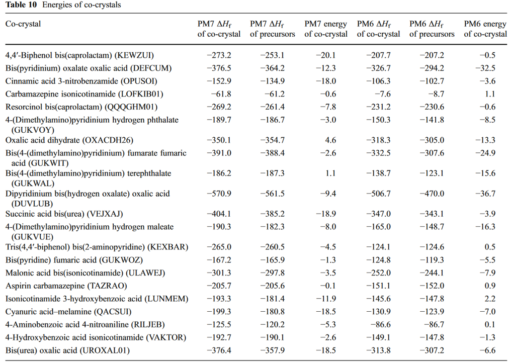

共晶为了存在，必须比其前体更稳定（即，它必须具有更低的 ΔHf）。
#### 4.1.9 元素
固体元素一直是半经验方法面临的挑战。因为纯元素具有独特的属性。固体元素中的所有原子都处于相同的环境中，因此离子项对键合没有贡献。所有键合必然是由于同一类型的原子对之间的纯共价相互作用。需要使用非限制性Hartree–Fock方法。

当使用PM6对元素建模时，计算结果显示一些元素会坍塌形成非常致密的固体，金属钴是最极端的元素（PM6 预测其密度为 73.5 g/cc）。这种结果很荒谬。在PM7的开发过程中解决了这些问题。

#### 4.1.10 离子的电荷
正如预期的那样，几乎所有含有IA和IIA族金属原子的化合物或多或少都是离子性的，金属原子上的电荷呈正电荷。电荷小于形式氧化态的数量可以看作金属原子与其相邻原子之间键的共价特征的量度。

多原子阴离子和阳离子在固体中很稳定，因此适合研究。可以通过将离子的部分电荷与碱金属和碱土金属离子的电荷进行比较来估计这些离子的正电性（表11）。

通常，多原子阴离子比它们的单原子阴离子更具离子性（表 12）。结果表明，即使是F-等极端负
电性离子的电荷也主要由其反离子的性质决定。

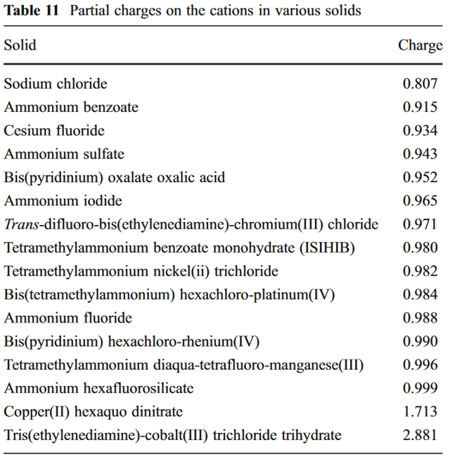
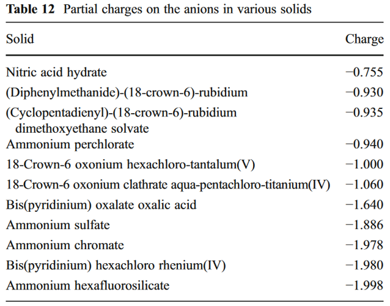

#### 4.1.11 矿物质
矿物可以被看作是自然存在的化学物质，它们有一个特征——矿物一般代表了构成该矿物的元素最稳定的组合。也就是说，矿物是由稳定的元素组成的化学物质，它们在自然界中具有稳定性和长期存在性。

蒸发岩天然碱$Na_3(CO_3)(HCO_3)(H_2O)_2$ 就是一个很好的例子。这种矿物质是在盐水蒸发过程中自然形成的，代表了液体中存在的特定离子混合物的最低能量结构。

因为它们的结构代表低能量配置，矿物提供了对建模方法的良好测试，因为如果该方法预测出的结构明显不同，则该方法肯定是错误的。

PM7模拟不同机械硬度矿物的能力是通过测量莫氏硬度来估计的。莫氏标度提供了一个很好的测试，因为原子间相互作用的范围非常广泛，从纯共价（金刚石）到​​混合共价和离子（磷灰石）到极弱（滑石层之间）。

一般来说，PM7在模拟硬矿物方面比软矿物更成功。因为大多数参考数据代表具有强共价键的系统，而不是弱的非共价键。当矿物的完整性取决于弱的非共价键时，能量中的小误差可能导致几何形状中的大误差。

### 4.2 蛋白质
开发 PM7 的一个目标是提高酶反应中势垒高度预测的准确性，因此，评估PM7准确模拟蛋白质的能力至关重要。蛋白质是大分子，结构很复杂，反应物和产物之间的能量差通常很小使得蛋白质建模很困难。

通常，为了使半经验方法起作用，被建模的化学系统必须尽可能真实。目标是确定PM7重现已知蛋白质结构的准确程度。

PM7用于模拟蛋白质数据库 (PDB) 中大约70种蛋白质的结构。由于PDB文件通常缺少氢原子并且结构和位置无序，因此在将其用于建模之前需要进行一些预处理。

来自该数据库的六种代表蛋白质的ΔHf和RMS几何形状的变化列于表13中。

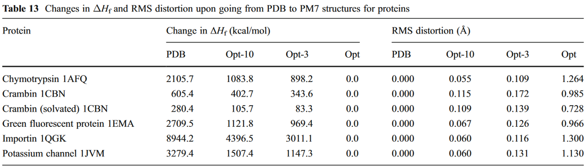

使用起始结构，执行完整的PM7无约束优化，从而产生优化结构（称为“Opt”）。如果起始PDB几何结构完全准确并且PM7可以准确地模拟化学系统，则PDB和Opt几何结构会一致。这意味着PDB和Opt结构之间的差异是错误的度量。但两种结构的比较无法区分是由实验限制引起的PDB结构错误还是由PM7理论方法引起的错误。

为了将错误区分来源（实验或理论），运行了两个约束优化。系统中的每个原子都应用了 10$kcal/mol^{-1}/Å^2$的能量惩罚函数。当原子从起始位置移开时，这会增加系统的能量损失，从而有效地使优化的几何结构（称为“Opt-10”）偏向起始PDB结构。另一项优化，惩罚函数为3$kcal/mol^{-1}/Å^2$，生成的几何形状（称为“Opt-3”）偏向PDB结构。

### 4.3 能垒高度
酶能催化许多类型的反应，从只发生在单线态或双线态电子表面的简单的键合-断裂反应到微妙的离子泵和涉及电子激发态的反应。

该文的反应范围仅限于最简单的类型。几个简单反应势垒高度的数据库被用于构建97种过渡态的参考数据。由于参考数据少，训练集增加了基态系统的参考数据。由此产生的方法（即PM7的理论框架和为再现能垒而优化的参数）被称为PM7-TS。使用PM7-TS计算的势垒高度的误差比PM6和PM7小。

## 5 讨论
### 5.1 使用半经验方法模拟酶反应
PM6和PM7都是为了提高对生物大分子建模的准确性而设计的。PM6有一个严重的局限性，即预测分子间相互作用能（在生物化学中非常重要的量）的准确性很低。PM7解决了此缺陷，使分子间相互作用能的误差减少了70%以上。

目前，没有令人满意的标准来衡量蛋白质建模方法的适用性。一个可能的标准是计算结构和X射线之间的误差。然而，该标准对远程弱相互作用中的错误非常敏感，因此即使是微小的能量变化也可能导致蛋白质链方向发生相对较大的变化。

另一种方法是检查用于模拟有机晶体的方法的适用性。如果蛋白质中发生的所有类型的相互作用都在固体中表示，则可以衡量该方法对蛋白质的建模能力。PM7用于模拟简单的有机固体时，ΔHf中的误差相对于PM6降低了60% 以上，几何误差降低了约 20%。如果模拟固体的能力可以转化为模拟蛋白质的能力，那么得出的结论是PM7具有显着的改进。

PM7-TS的开发使得可以对简单有机反应中的活化能垒高度进行精确建模。预测的准确性可以随着能垒数据集的增加而提升。

假设PM7-TS方法的预测能力很好，现在应该可以使用纯半经验方法来模拟酶催化反应中的可能机制，包括预测活化势垒以及反应物和产物的形成热。

#### 5.1.1 计算势垒高度的步骤总结
1. 确定反应的步骤，需要确定三个阶段：反应物，过渡态和产物。
2. 以PDB为起点获得一个初始结构。
3. 进行预处理，添加氢原子以满足化合价要求并优化其位置。使用`线性缩放MOZYME技术`代替传统的矩阵代数方法。
4. 整个系统将被允许放松，以达到一个更加平衡和稳定的状态。
5. 用底物替换抑制剂。当抑制剂用于研究酶催化反应时，过渡态通常被模拟为抑制剂-酶复合物。一旦了解了过渡态的结构，就可以使用相应的底物代替抑制剂，并进行计算，以获得反应物或产物的几何结构。
6. 根据上一步的结果，再次将抑制剂替换为底物，但现在底物的部分将被移动，以使系统再次放松时，得到的几何形状对应于反应的另一端。换言之，通过调整底物的几何结构，使它们可以在反应的两个方向上运动，从而实现反应的完整过程。
7. 有了反应物和产物的结构，就可以开始寻找过渡态（使用MOPAC2012中的GEO_REF选项）。在该过程中，反应物和生成物的几何形态都已知，并且在反应能垒逐步上升的过程中，将基于当前几何构形与更高能量几何构形之间的差异对低能量的构形优化，以获得一个很好地近似过渡态结构的构形。只要该反应的反应物和生成物的几何形态准备正确，这个过程就是简单的。
8. 然后完成过渡状态微调。这包括一个重复的两步过程。第一步，执行梯度最小化。只有紧邻反应点的那些原子可以移动，所有其他原子都保持冻结状态。第二步，涉及能量最小化。在这一步中，所有在第一步中被允许移动的原子现在都被冻结，所有在第一步中被冻结的原子现在都被允许移动。重复这个两步过程，直到结果的变化小到可以接受为止。
9. 一旦找到一个固定点，计算过渡态的振动频率，以验证是否存在一个且只有一个虚频。此步骤只需要参与梯度最小化的原子的Hessian矩阵。这有两个好处：首先，减少了计算量；其次，通过仅在活性位点产生振动的方式，避免了结构（例如旋转甲基）产生的所有错误虚频率。
10. 现在已经有三种几何形态了：反应物、猜想反应的过渡态和产物。通过使用PM7-TS计算每种几何形态的ΔHf，可以得出对改进的势垒高度估计。简单来说，可以通过计算三种几何形态的热力学数据来更好地估计反应的能垒高度。
11. 在完成分析时，应计算内在反应坐标。对于一个反应中的过渡态，需要在两个方向上分别进行计算，以得到完整的反应路径。这些计算将使用内在反应坐标系统来描述反应过程中的能量障碍和能级变化。(IRC)
### 5.2 为什么半经验方法如此准确？
从头算方法的大部分耗时数学运算都被相对简单的近似值所取代。假设使用近似值会导致预测的准确性会受到影响，因为半经验方法不如其更复杂的理论模拟方法完整。但使用 PM7 时预测的有机化合物的生成热中的误差明显小于使用更昂贵的B3LYP方法，因此这一假设显然是不对的。为什么现代半经验方法如此准确？

半经验方法将理论框架与经验确定的参考数据或高精度的理论生成数据相结合。根据定义，从实验结果得出的参考数据是准确的，并且包括所有可能的理论影响因素，例如零点能量、内能、单电子和双电子现象、瞬时相关、相对论效应等，以及其他尚不为人所知的影响因素。从头开始准确计算理论效应显然非常困难，但通过将自然界视为参考数据的来源，就简单多了：从实验观察中获得的参考数据的值显然包含了该数据所代表的所有现象。（从头算的理论还不够完善，但对实验数据的拟合更贴合实验）。

半经验方法本质上应该是高度准确的。换句话说，半经验方法被设计用来重现已知的东西，并且它们能够以很高的准确性这样做。当然也希望方法具有预测性。

如果目标是从头开始预测化学性质，则必须考虑所有可能涉及的现象。对于仅涉及轻元素的部分，这意味着（至少）CCSD(T)/CBS 对内部和零点能量进行了校正，如果涉及较重的元素，则还需要考虑相对论效应和其他现象。从头计算方法，根据定义，不使用参考数据，因此如果这种方法要具有预测性，就必须准确计算每种现象的每个成分。从头计算中任何阶段的错误都可能导致结果无效。
### 5.3 对未来改进的推测
半经验方法在过去几十年中稳步改进，主要有三个主要改进：
1. 方法变得更加准确
2. 在元素数量和可以建模的现象类型方面，应用范围有所增加
3. 提高预测能力。
原则上，如果可以消除三种类型的错误，半经验方法将是完全准确的。
- 首先，理论框架必须足够现实和灵活，由此产生的半经验模型才能很好地反映现实；
- 其次，必须以足够的精度定位参数空间中的最小值，以使参数值的修改不会导致误差函数的显着降低；
- 第三，参考数据集必须足够大且用途广泛，以允许定义最小参数空间（即确保相关参数 Hessian 的所有特征值都显着非零）。

可以通过查看`生成热`和`几何结构`中的误差分布来估计这些目标的实现的程度。由于这两个属性都有大量的参考数据，所以特别适合进行分析。

#### 5.3.1 理论框架的错误
半经验方法对于一些涉及不常见键合的化合物，误差会很大。表明理论框架存在缺陷。

理论上的错误只能通过改变`逼近方法的代数形式`（新公式）来进行纠正。设计这样的公式很困难，但将这些变化转换为软件则比较容易。在该工作中，为纠正这种类型的错误投入了很少的精力，因为由于理论上的错误导致的预测热值形成的大误差的数量非常少，并且那些糟糕的预测化合物的类型是众所周知的。

在量子化学模拟中，有些量需要高精度地建模。一个在ΔHf中可以容忍的误差，在分子间相互作用中可能是完全不可接受的。为了纠正这个问题，进行了几次尝试，每次尝试都涉及添加相对简单的分子力学校正；即，一个具有少量参数的简单代数函数。有时候我们发现需要对化学反应模型进行一些简单的修改，但却并不容易，因为其涉及的可能不仅仅是修改本身的逻辑。但随着计算工具和参考数的发展，很容易测试各种理论框架的优缺点，以此来进一步指导研究。

#### 5.3.2 不完整的参数优化
在早期NDDO方法的开发过程中，参数优化所需的大量计算工作阻碍了参数空间的最小化。尽管存在这种限制，但随着每种新方法的开发，平均误差都会显着下降。借助现代硬件和函数最小化技术的进步，现在可以更轻松、更可靠地执行参数优化。

参数优化的其他方面也得到了改进。当一个元素第一次被参数化时，在选择参数的初始值时存在问题。现在，当对现有方法进行修改时，直接使用原本参数作为参数的起始值。当代表当前元素的参数在化学模拟中出现局部最小值时，可能会发现这并非全局最小值，但随着需要模拟的化学范围的不断扩大，误判全局最小值的可能性会不断减小。如果有证据表明当前这个最小值不是全局最小值，这些证据可以用来寻找真正的全局最小值。简单来说，即随着模拟范围的增大，可能出现误判的局部最小值会逐渐被发现，从而更加精确地找到全局最小值。

#### 5.3.3 参考数据的局限性和错误
大量的参考数据集可用于预测分子几何结构。包括CSD和ICSD；这些数据库涵盖了范围广泛的化学相互作用类型。近年来，已经创建了一些高质量的分子间相互作用能的参考数据集合，以及一些其它的量，例如反应势垒的高度（高质量计算的结果）。

以上表明，有足够的参考数据可以对半经验方法进行参数化，并可以测试方法的准确性。但在实践中，参考数据的类型和数量都存在严重限制。可以通过参考开发半经验方法所需的数据类型来理解这些限制的本质。

PM7 等方法中的参数可分为两种：单原子和双原子。对于单原子参数，可以使用常规参考数据来定义参数空间中的最小值。在开发MNDO方法的时候，只用了几十个化合物。

但双原子参数很困难。使用双原子参数可以显著提高预测 训练和测试集 中热力学性质与几何构型的准确性。但会降低预测能力。在为双原子参数建立参数空间的过程中，至少需要两个与所考虑的原子成键环境的参考数据，才能确定该原子对的参数空间中的最小值。这个条件在简单的有机化学中容易满足，其中有大量数据涉及每种可能的双原子组合。这些数据中的大部分涉及气相物质，非常适合用作参考数据。

许多原子对不能转化为离散的气相化学物质，不适合作为参考数据。

82种元素之间可以组合成3403种原子对，但是目前的数据库中并不包含所有可能的组合。虽然大部分组合对于化学研究不重要（如Sc–Ag或Ti–Ne），但某些组合系列（例如F-X和O–X，其中X代表大部分元素）很有研究价值。针对半经验方法的开发和验证，从考虑有哪些数据可用的角度，转而考虑需要哪些参考数据，然后研究如何生成这些参考数据，可以更有利于研究。

一个很好的参考数据来源是使用现代高度准确的理论方法。但到目前为止，这些方法应用有限。比如建模已知的物种（例如已知的小气相系统）或特定感兴趣的物种（例如用于确定分子间能量的气相双分子复合物）。在发展和测试新的理论方法时，需要使用一些`不常见或不存在于自然界中的物种`进行测试。

这样的数据将是全新的，并且对于开发新的半经验方法非常有用。 PM7 现在是 NDDO 型半经验方法中最准确的方法，但即使在 PM7 中，热化学和几何特性的预测精度也因元素而异。对于“流行”的元素，例如涉及简单有机化合物的元素，准确度相对较高。对于“冷门”元素，即属性不常被测量的元素，准确度较低【要么是因为元素稀有（如 Sc），要么是因为它们根本不容易使用（如 Ag）】。以银为例：因为它形成的气相化合物很少，所以热化学参考数据很少；因此，各种类型的双原子参数最小值都没有明确定义。结果是 PM7 在预测含银固体的特性时的准确性非常低。这一结果【预测流行元素的化合物性质的准确性高，而冷门元素的化合物性质预测的准确性低】可以概括为半经验方法的准确性主要取决于参考数据的质量。可见，如果有适当的参考数据来源，就可以大大提高半经验方法的准确性和预测能力。

#### 5.3.4 替代方案：避免使用双原子参数
使用双原子参数可以提高精度，但也会导致参数数量的增加，并且增加获得合适参考数据的难度。如果能够找到一种方法或公式，可以根据已知的双原子参数值来生成这些参数值，就可以避免对每个核-核参数都必须进行独立最优化的要求。可以使建模过程更加高效和可扩展。可以直接获得每个可能的双原子相互作用并用于建模。

原子序数小的原子，双原子参数产生的函数随着距离的增加而迅速下降，如图 8 所示。对于原子序数较大的原子，函数下降的速度较慢。

目前还没有迹象表明有任何尝试开发一种公式来将原子对与Voityuk参数相关联。这可能是因为这种表达式要求的模糊或定义不清。然而，随着PM6和PM7的发展，可以用这些方法的各种双原子参数值作为该公式的参考。开发一个合适的方程来再现各种核-核相互作用的问题将转变为拟合两组双原子参数中的一个。这样的函数将具有单原子参数，还取决于原子序数和其他量。无论这个函数变得多么复杂，它都不太可能具有现有双原子相互作用中的很多项。
#### 5.3.5 确定方法的准确性
每开发一个新的半经验方法，都需要测试其相对于其它方法的准确性。如果使用的的数据集很小，并且新方法专门针对数据集进行优化经，那么它看起来肯定比其他方法更准确。因此要开发一种无偏见的准确性衡量标准，以避免错误的高精度。

虽然化学是一门庞大的科学领域，但化学性质的独立数据量仍很有限。为了填补这个空白，现在正在使用高水平理论计算的结果来补充。

在PM7的测试过程中，尝试包括尽可能多的热化学数据，包括气相物质和固体。这种尝试的缺点在于只使用了数据库中的一小部分，尽管有证据表明某些数据不准确，但统计结果证明这样做（至少作者认为）比任何早期的半经验方法更可靠。

如果可以使用一个准确性无可挑剔的热化学数据数据库作为训练集和验证所得方法的参考数据源，则可以消除其中许多问题。理想情况下，这样的数据库包含用高水平理论计算增强的实验结果，特别是于难以通过实验方法获得的特性（例如分子间相互作用能）。
## 6 结论
半经验方法作为 模拟化学系统的实用工具 已经扩展到更广泛的化学体系。在略微调整近似值并引入非共价相互作用代理函数后，准确性显著提高。（生成热、酶催化势垒等）。

未来可以通过完善参考数据集来进一步提高准确性。但目前，参考数据严重短缺，导致参数空间的大部分未定义。而许多现有参考数据的准确性也值得怀疑，因此方法中的很大一部分错误可归因于数据集。另一部分错误的可能是由于是数优化不完全，但这种误差现在可以可以很简单地消除。

目前的错误可能来源于半经验方法的理论框架或近似值。当前的一系列近似方法已经非常强大，允许对各种类型的系统进行建模。未来可能会侧重于纠正现有近似的错误，而不是引入完全新的特性。半经验方法领域发展的非常快速和健康。目前最先进的PM7只是众多模型之一，在未来肯定会被更好的模型所替代。