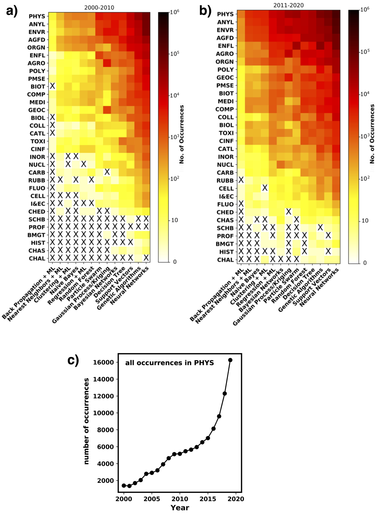
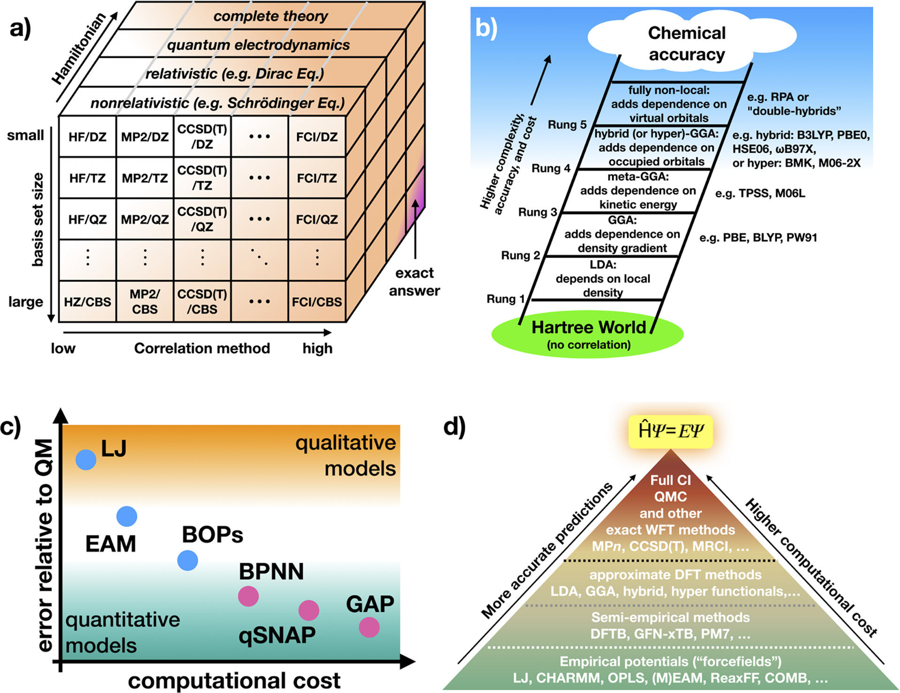
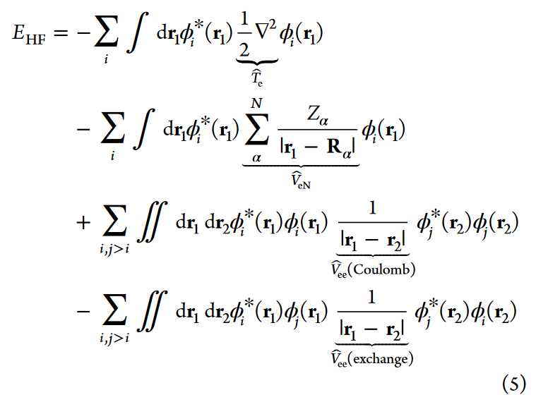
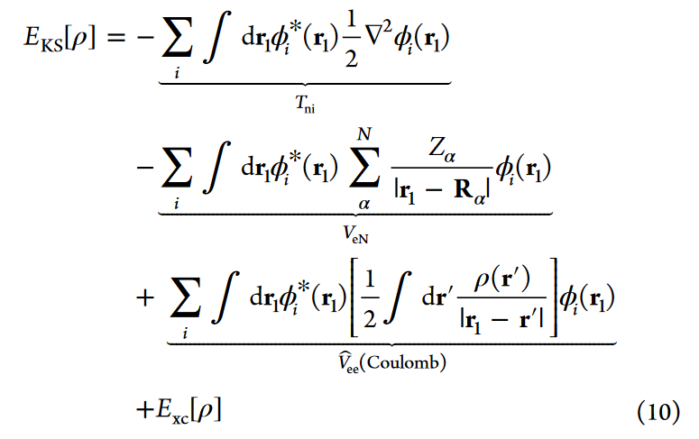
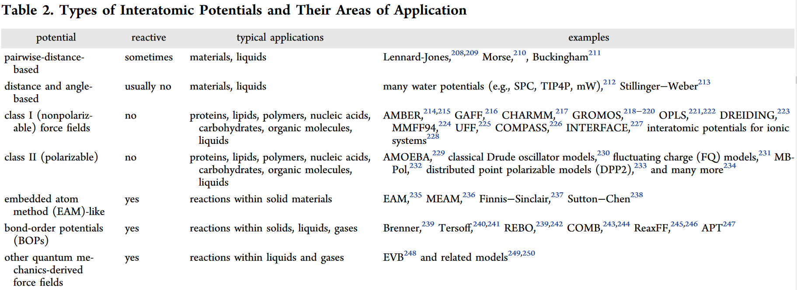
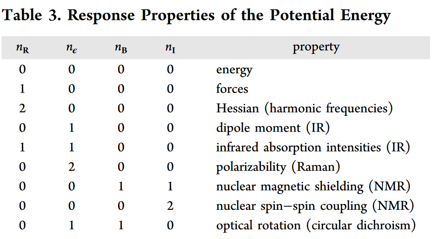

# 2022-11-2
> Combining Machine Learning and Computational Chemistry for Predictive Insights Into Chemical Systems
## 1.介绍
### 1.1 背景
### 1.2 文章动机

## 2.计算化学以及其与机器学习的重要交集
### 2.1多尺度的计算化学模型，数据以及信息
该部分介绍不同的计算化学方法如何应用于不同层面的物理，然后介绍这些方法产生的数据如何应用于机器学习。

#### 2.1.1模型以及抽象级别

模型从数据中抽取信息，公认的“好的”模型都是简洁的。例如PV=nRT，描述观测量之间的必要联系。但其只能描述理想气体。而要想描述真实情况，就要添加更多的参数，进行更复杂的运算，这就成了一个“不好”的模型。
计算化学首先决定系统的结构和能量，然后再计算出我们感兴趣的一些性质，本节介绍了许多算法，尽管他们很难，读者不能充分理解，但他们在很多量化程序中都已经实现了，所以也可以将他们当做黑箱模型。成为了一个提供数据的工具。

*图三：计算方法的等级以及响应的时间和尺度规模。QM代表量子力学。*
#### 2.1.2计算化学的表达
计算化学的研究可以由简单(真空中的水分子)到复杂(电化学环境下对固液界面的描述)。

#### 2.1.3方法的正确性
介绍了量化计算误差的来源。
#### 2.1.4精度和重现性
分子动力学重现性就不好
### 2.2 方法的等级

*图4：虚构分子的势能面，具有两个坐标。势能面上的最低点对应系统的一个稳定结构。最低点之间可以被路径连接(红线)，可以发生反应，路径上的最高点是过渡态，过渡态势一阶鞍点，在某一个坐标是最高点，其他坐标是最低点。对应于两个势能面上最低点转变的最小能量，在化学反应中占有重要地位*
使用PES可以推倒出一些高级性质(热力写结合常数、反应动力学速率常数、基于系统动力学的性质)

*图5：（a）“魔方”描述相关波函数方法的层次。（b）“雅各布的梯子”描述了Kohn - Sham密度泛函理论(DFT)方法的层次。（c）原子势的层次。（d）预测原子尺度建模方法中的整体层次。*

都属于图3中最下面两个等级
#### 2.2.1波函数理论方法

在标准的计算量子化学中，体系能量可以通过求解薛定谔方程获得。波函数用来描述核与电子的位置，其平方描述核与电子位置的真实概率密度。在真实的系统中，一个粒子(位置)与其它粒子是有关联的，导致不能精确求解薛定谔方程。为了简化问题，首先使用奥本海沫近似：原子核的质量相较于电子要大得多，所以其位置可以认为是不变的。这允许使用与时间无关的Schrödinger方程计算能量，并解决特征值问题:

$$
\hat{H}\Psi=(\hat{T}+\hat{V})\Psi=E\Psi \tag{1}
$$

哈默顿算符是动能算符与势能算符之和，$\Psi$是波函数(本征函数)，表达系统中例子的状态，$E$是能量(本征值)，当固定原子核之后，公式1就成为了`电子的薛定谔方程`，其哈密顿$\hat{H}_{el}$和波函数$\Psi_{el}(r;R)$只取决于原子的坐标

$$
\hat{H}_{el}\Psi_{el}(r;R)=[\hat{T}_e(r)+\hat{V}_{eN}(r;R)+\hat{V}_{NN}(R)+\hat{V}_{ee}(r)]\Psi_{el}(r;R)=E_{el}\Psi_{el}(r;R) \tag{2}
$$

$\hat{H}_{el}$包含单独的电子项，核-电子项，核-核项，电子-电子项。

第二种常用的近似是将总电子波函数扩展为单电子波函数(即自旋轨道):$\varphi(r_i)$。电子是费米子，具有范对称性，导致了泡利不相容原理。反对称原理意味着任意两个电子的交换都能导致波函数整体的符号发生改变。为了从数学上满足到这一性质，可以将一个电子自旋轨道组合成斯莱特行列式的形式：

$$
\Psi(r_1,...,r_n)=\frac{1}{\sqrt{n!} } \begin{vmatrix}
  \phi _1(r_1)& \dots  & \phi _n(r_1) \\
 \vdots  & \ddots  & \vdots\\
 \phi _1(r_n)  & \dots  & \phi _n(r_n)
\end{vmatrix} \tag{3}
$$

当行列式的两行或列交换时，符号也会发生改变，这就对应着交换电子导致波函数符号改变。$\frac{1}{\sqrt{n!} }$是归一化常数，确保波函数是单位的。自旋轨道可以看成是用$\mu$个泛函$\chi_\mu$展开得来的，每一个泛函都有一个系数$c_{\mu i}$，通常是高斯型基函数，或者是在边界条件下的平面波：

$$
\phi_i=\sum_{\mu}c_{\mu i}\chi_\mu \tag{4}
$$

不同类型的数学函数具有不同的优缺点。越大的基组具有越多的基函数，能更好表达体系中的电子，但具有更大的计算量。在电子结构计算中避免大量计算工作量的一种标准技术是用有效核心势(ECPs，即伪势)的解析函数代替不反应的核心电子。更大的原子核带来更高的原子序数和更多的电子也会表现出相对论效应，而相对论哈密顿量是基于狄拉克方程或量子电动力学的。这些方法的计算成本有高有低。实际应用使用标准的非相对论哈密顿方法，以及ECPs(或伪势)，这些方法被明确地开发来解释由相对论效应产生的压缩核心轨道。

使用Born−Oppenheimer近似(eq 2)和用有限基集(eq 4)表示的Slater行列式波函数(eq 3)产生了最简单的基于波函数的方法，即Hartree−Fock (HF)方法。HF方法是一种平均场方法，其中每个电子都被视为在所有其他电子产生的平均场中移动。当描述许多化学系统时，它通常不准确的，但它是计算化学电子结构计算的核心，为所有其他精确方法建立基础，提供一些CompChem方法不提供的能量贡献(即精确交换)。比HF理论更高精度的计算化学方法包含电子相关，这是理解分子和材料的关键部分。将$Ψ$表示为斯莱特行列式，并重新排列eq 2，同时暂时忽略核-核相互作用，这样就可以用电子自旋轨道的积分来定义HF能量:

前两项是单电子积分，表达电子的动能以及核电之间的势能。剩下的是双电子积分描述了来自于电子-电子相互作用(库伦积分)和交换的势能。使用`拉格朗日乘数法`，HF公式可以用矩阵表达，叫做Roothan−Hall公式，可以有效求解：

$$
FC=\epsilon SC
$$
每一个矩阵的大小都是$\mu \times \mu$的，$\mu$是用来表达系统轨道的基函数的数量。$C$是系数矩阵，包含了基函数的系数$c_{\mu i}$，S是重叠矩阵衡量每两个波函数之间的重叠程度$\epsilon$是自旋轨道能量的对角矩阵。$F$是Fock矩阵，元素与eq5的形式相似但用基函数项来表达。eq6中的系数矩阵在求解前要提前确定，eq6不能以闭合的形式求解，而是用自恰场的方式求解。

由波函数的反对称性引起的电子交换相互作用对电子波函数的ML模型的数学形式有很强的约束。构建高效可靠的多体波函数反对称ML模型是当前研究的一个重要领域。
#### 2.2.2相关correlation波函数方法
体系的相关能被定义为电子-电子相互作用的总和，这些电子-电子相互作用来源于HF理论提供的电子-电子相互作用的平均场近似。虽然`相关能`在一个系统的总能量中所占的比例相当小(通常约为总能量的1%)，但由于分子和物质系统的内能非常巨大，所以相关能的贡献变得相当重要。例如，如果使用理论的HF计算，大多数分子晶体都不稳定。失去的成分是引力，是从考虑相关能的理论等级获得的。相关能是通过计算额外的电子-电子相互作用能得到的，这些相互作用能来自于电子构型的不同排列(不同可能的激发态)，而这些电子构型没有用HF的平均场方法处理。

最完整的相关处理方法是`完全组态相互作用`(FCI)方法，它是电子薛定谔方程(在完全基极限下)准确的数值解，考虑了电子所有可能激发的构型所产生的的相互作用。FCI波函数采用所有可能激发态Slater行列式的线性组合的形式，这些行列式可以通过电子激发由单个HF参考波函数产生：

$$
\Psi_{FCI}=a_0\Psi_{HF}+\sum_{\alpha,\beta}a^\alpha_\beta\Psi^\alpha_\beta+\sum_{\alpha,\beta,\gamma,\delta}a^{\alpha\gamma}_{\beta,\delta}\Psi^{\alpha\gamma}_{\beta,\delta} ···
$$

$\Psi_\alpha^\beta$是将占据轨道$\alpha$的电子激发到空轨道$\beta$得到的，as是展开系数，指每一种组态的权重。FCI计算随着电子数量的增长而指数级增长，所以只适用于小分子。已经作为苯分子高精度计算的基准。

为了简化计算，大多数相关的波函数方法使用FCI中的一部分，叫做CI。`耦合聚类`(coupled cluster)理论是另一种广泛使用的后-HF方法，通过聚类(cluster)算符包含了额外的电子组态。CCSD(T)是一种包含单、双、三重态的耦合聚类方法，被称为计算化学电子结构方法的“金标”方法，因为具有较高的分子能量精度。在CCSD(T)方法上也有很多改进的方法。注意：一种方法有名是因为它的精度高而不是适用于所有体系。例如苯分子，很好地说明了点共振键描绘了一个具有相等C-C键长的平面分子。很多计算方法都不能发现这样的稳定结构，部分原因是化学键相互作用或者是不同理论水平所选择基组导致的误差。

需要注意的是这些方法都是建立在HF方法之上的，因此计算量都比HF大。但是可以通过提升计算性能来解决，例如使用图形处理单元(GPU),以及一些提高效率的算法，例如RI,DLPNO,R12\F12。也有一些正在开发的基于量子蒙特卡洛和密度矩阵重正化方法(DMRG)，与其他方法相比具有高精度。也有很多人尝试用机器学习来加速这种类型的计算。

为了减小不同基组，不同理论等级之间的误差，开发了一些方法，以便于推出精确的结果。例如完全基组(CBS),高斯Gn，HEAT等。这些方法也成为最近ML工作的目标。

HF行列式为许多分子的基态电子结构提供了很好地基线近似，但可能描述不好更加复杂的成键，激发态等方面。一些多体波函数被描述为两个或更多组态的叠加，例如，当其公式7中他的组态具有比HF行列式类似或更高的展开系数。由于这个原因，像CCSD(T)这样的高质量但参考方法失败了因为该理论假设显著的电子效应被初始的单一HF组态所捕获。在这种情况下，寻找可靠地黑箱或者自动化程序就很重要(例如在设计共振态，化学反应，分子激发态，过渡金属配合物以及金属材料等情况)。所谓的多组态方法，例如GVB,CASSCF,MRCI,CASPT2,MRCC，可以更加符合物理地为这些体系建模，因为他们使用了几种合适参考组态，并进行了几种不同程度的相关处理。这些方法不是黑箱，应该要求有经验的CPI从业者选择可以对结果质量产生实质性影响的参考状态。在这个领域，ML可以在自动选择物理上合理的活动空间方面取得进展。

总结，有大量可用的相关波函数方法，但计算成本都比HF高。图5a中的魔方显示了不同哈密顿量，基组和相关处理方法之间的层次结构。这使得识别不同的波函数方法更容易，这些方法应该更准确，更有可能提供有用的原子尺度的见解(以及那些计算更密集的方法)。“魔方”中强调的另一个重要方面是，更高级别的波函数方法需要更大的基组才能成功地模拟电子相关效应。例如，使用小基集进行的CCSD(T)计算可能只能提供与MP2相同的精度，而计算成本要高出两个数量级。正如前面提到的苯系统，不同基组任然有伪误差，这表明理论水平和基组的特定组合存在问题(有点像数据集和模型复杂度)。相关波函数方法的复杂程度使其成为计算化学+机器学习研究的一个很有前途的领域。

#### 2.2.3密度泛函理论
密度泛函理论(DFT)是用依赖电子密度的泛函的能量表达式计算系统量子力学内能的另一种方法$\rho=|\Psi_{el}(r;R)|^2$:

$$
E[\rho]=T[\Rho]+V[\Rho]
$$

与波函数的方法相比，DFT效率更高因为关于电子密度的自由度永远是3，而波函数的自由度是3n，DFT有一个重要的缺点，即能量泛函的精确表达式目前未知，所有的近似都会带来某正程度的不可控误差，这让那些纯粹的化学物理主义者不满，特别是那些正在开发波函数方法的人。然而大量证据表明，对于许多实际应用来说，DFT近似是相当准确和可靠的，这些应用带来了信息、知识还有观念。我们现在提供了一个关于DFT方法的鸟瞰图。

自从DFT诞生以来，其发展的一个重点是严格按照电子密度设计表达式，这些方法被称为“动能(KE-)”或“无轨道(OF-)”DFT。有些能量贡献(例如核-电子和电子-电子能量项)可以精确地表示出，但其他的项，例如动能作为密度的函数是未知的，必须用近似值表示。OF-DFT在计算上非常高效(这些方法应该随系统的大小线性增加)，但这些波函数公式的准确性还不能比得上波函数，尽管他们已经被用于研究不同类别的分子和材料。人们应该期望，一旦高精度形式得到发展和成熟，计算化学对于拥有超过100万个原子的体系的电子结构的精确计算可能会变得很常见。事实上，人们正在努力使用ML开发更加物理的OFDFT方法。

DFT最常用的形式(也是目前使用最广泛的)是Kohn-Sham(KS-)DFT。在KS-DFT中，假设有一个虚构的无相互作用的电子系统与真实的系统具有相同的基态密度。这使得将eq 8中的能量泛函分解成一种新的形式，该形式包含了非相互作用电子动能的精确表达式:

$$
E[\rho]=T_{ni}[\rho]+V_{eN}[\rho]+V_{ee}[\rho]+\Delta T_{ee}[\rho]+\Delta V_{ee}[\rho]
$$

$T_{ni}[\rho]$是非相互作用电子的动能、$V_{eN}[\rho]$是精确的核电势能、$V_{ee}[\rho]$是非相互作用电子的库伦(经典)能。后两项是对电子相互作用的性质和非经典电子-电子排斥的校正。KS-DFT还将三维电子密度展开为与HF定义的自旋轨道基$\phi$，从而直观地定义了单电子动能。这使得$T_{ni}$、$V_{eV}$和$V_{ee}$可以精确求出数值解，从而得到KS能量：

公式9中最后两个校正项来源于电子相互作用，他们被组合为所谓的“交换相关”项($E_{xc}$)，它唯一定义了正在使用的KS-DFT的方案。理论上，一个精确地$E_{xc}$项能得到 精确的FCI能量 与 基态无电子相互作用系统 之间的所有差异。

KS-DFT能够用与公式6类似的形式进行转换，可以提高计算效率。此外，KS矩阵(代替Fock矩阵)的元素更容易计算，因为现在通过$E_{xc}$容易得到一些原本很难计算的积分。因此KS-DFT的计算规模与电子数量之间的关系式$n^3$。尽管这与想像中的OF-DFT的线性比例相差很远，对无相互作用电子的精确处理使KS-DFT更加精确。此外，有几种现代的交换-相关泛函比HF理论具有更高的精度，计算成本更低，因此在许多现代应用中，KS-DFT是与许多相关波函数方法竞争的替代方法。

剩下的一个问题是为交换-相关泛函构建一个合适的表达式，因为其确切的泛函形式仍然未知。者产生了大量基于不同程度的原理或经验的方案。KS-DFT泛函的分类是由交换相关泛函是否仅仅基于均匀电子气体(即“局域密度近似”，LDA)，及其导数(即“广义梯度近似”，GGA)，以及其他在物理上改进描述或误差消除的附加项来定义的。KS-DFT泛函的层次结构被称为DFT的“雅各布阶梯”(图5b)。一般来说，某种方法在梯子上的位置越高，计算就越精确，但也需要更大的计算量。然而，DFT固有的不精确性使得很难评估哪些泛函在物理上比其他泛函更好。尽管如此，雅各布阶梯层次结构对于说明特定应用中应该如何以及为什么使用某种新方法非常有用。

事实上，由于DFT计算基于均匀电子气的基态表示，有时可以更容易地对波函数理论难以检验的一些体系(例如，金属)进行物理洞察。另一方面，DFT通常也不适用于研究涉及局域轨道或带结构的物理现象，如在具有小带隙的半导体材料、分子或材料激发态电荷转移态或激发态可能产生的相互作用力，如色散力。上述的特点通常可以使用hubbard校正的DFT+U模型来处理，该模型需要系统特定的U−J参数，或更一般化但计算成本更高的混合DFT方法。色散力(即范德华相互作用)在半局部DFT近似中是不存在的，现在使用各种不同的方法将色散力引入到DFT计算中是很常见的。

人们对使用嵌入CompChem计算方案也越来越感兴趣，这种计算方案可以将系统划分为离散区域，分别用高精度相关波函数理论和计算效率高的KS-DFT方案进行处理。DFT也被扩展到以时间依赖(TD-)DFT的形式对激发态进行建模。与基态DFT相似，TDDFT是一种计算成本较低的基于激发态波函数的方法。当激发态只引起基态密度的微小变化时(例如低激发态)，这种方法可以得到合理的结果。然而，由于TDDFT的单参考性质，在多个电子组态对激发态有显著贡献的情况下，它表现不好。就像相关的波函数方法一样，已经有迹象表明CompChem+ML努力提高基于dft方法的适用性。

#### 2.2.4半经验方法
相关波函数和KS-DFT(在较小程度上)仍然对计算有很高的要求，只在大规模模拟中有限地使用。进一步的近似基于波函数和DFT方法已经发展，以简化和加速能量计算。这些所谓的半经验方法仍然明确地考虑分子的电子结构，但采用以比上述方法更近似的方式。

基于波函数理论的半经验方法包括扩展Hückel理论和忽略双原子微分重叠(NDDO)的方法。这两种方法都是通过对不同积分引入近似来简化HF方程(公式5)。在NDDO方法中，只考虑公式5中的双电子积分，其中$\frac{1}{|r_i-r_j|}$算子的左右两边的两个轨道位于同一个原子上。剩下的双中心(和单中心)积分则通过引入一组经验函数来逼近，每一种类型的积分都有一个经验函数。并且假设eq 6中的重叠矩阵为对角化的，大大简化了能量的计算。这极大地减少了计算量，计算规模减少到$N^2$。NDDO可作为更复杂的半经验方案的基础，如AM118、PM7和MNDO，其通常使用最小基组。理论上的不足可以通过不同的经验参数方案来弥补，这可以使这些计算在某些体系中与更高层次理论的精度相媲美。例如，Dral等人提供了最近的“大数据”分析，分析了几种具有大数据集的半经验方法的性能。

半经验方案也被用来模拟具有所谓密度泛函紧密绑定(density functional tight binding)(DFTB)的KS-DFT。DFTB将总电子密度$ρ$分解为自由和中性原子的密度$ρ_0$和一个小扰动项$δρ_0(ρ = ρ_0 + δρ_0)$，从而简化了KS方程(eq 10)。在微扰$δρ_0$中展开eq 10，可以将总能量分成三个项，可根据不同的近似方案修正:

$$
E[\delta \rho_0]=E_{rep}+E_{Coul}[\delta \rho_0]+E_{BS}[\delta \rho_0] \tag{11}
$$

$E_{rep}$是一个排斥势，包含原子核之间的相互作用和交换相关泛函的贡献(这些通常通过成对势近似)。电荷波动(fluctuation)项$E_{Coul}$是由近似电子密度计算的高斯电荷分布的库仑势。最后，$E_{BS}$指“能带结构”项，它考虑了电子结构并包含来自$T_{ni}、V_{eN}$和交换相关泛函的贡献(见eq 10)。为了计算$E_{BS}$，密度用原子轨道的最小基表示，类似于NDDO。然后通过基于Slater - Koster变换的近似方案计算必要的哈密顿积分和重叠积分。除了能量，在这一步中还计算原子部分电荷(partial charges)，然后在$E_{Coul}$中使用。因此，DFTB方程也可以自洽求解。DFTB方法通过寻找排斥势的合适形式和调整Slater - Koster积分的参数来寻找参数。非自洽和自洽紧绑(tight-binding)DFT方法已发展到模拟大规模系统。半经验方法也是许多ML的目标，产生改进的参数化方案和更精确的函数近似。
#### 2.2.5核量子效应
轻元素，如H−Li，以及重元素(石墨烯中的C−C键)，他们的量子特性会产生核量子效应(nuclear quantum effects NQEs)。这种效应导致了许多误差，如固体热容量的Dulong - Petit极限、同位素效应以及粒子动量分布与Maxwell - Boltzmann方程的偏差。为了捕获NQEs，可以使用路径积分分子动力学(path-integral molecular dynamics PIMD)或质心分子动力学(CMD)，但与使用点核的经典MD模拟相比，这些方法的计算成本要高得多(通常约为30倍)。此外，由于系统可能会受到相互竞争的NEQs的影响，NEQs的程度对假定的势能面很敏感。(半)局部DFT方法甚至可能无法定性预测同位素分离(isotope fractionation)比，通常需要混合DFT才能达到定量精度。然而，在PIMD/CMD模拟中使用混合DFT计算或其他高级方法会产生极高的计算成本。基于这个原因，ML力场被认为是进行PIMD模拟的有效手段，使电子和核自由度的量子力学处理基本准确，至少对于具有数十个原子的小分子是这样。

#### 2.2.6核间势
与上述方法相比，核间势引入了一个额外的概念级别。与使用精确的量子力学表达式来创建系统的PES不同，用解析函数建模一个预设的PES，其中包含原子之间的显式相互作用，而电子则以隐式方式处理(有时使用部分电荷方案)。因此核间势(通常非常显著)比相关波函数、DFT和半经验方法的计算效率更高。这种效率使其可以研究比其他计算方法更大的原子系统(如生物分子、表面和材料)。注意，不同的经验势带来了实质上不同的计算效率；例如Lennard-Jones (LJ)势比经典力场(FFs)如AMBER和CHARMM更有效，而经典力场比大多数键序势(ReaxFF)更有效。效率的程度来自于使用正确的或物理上合理的函数形式、近似和模型参数化的平衡。有许多不同的公式(参见图5c)，我们将讨论其中最通用的。表2概述了不同类型的原子间势及其特征。

对于这些方法包括半经验方法的广泛讨论，我们参考了Akimov和Prezhdo的综述。不同类型FFs之间的区别有时可能是模糊的，我们将按递增的复杂性来区分类别。最简单的原子间势之一是LJ势:

$$
E_{LJ}=\sum_{i,j>i}4\varepsilon _{i,j}\left [ \left ( \frac{\sigma _{ij}}{r_{ij}} \right )^{12}-\left ( \frac{\sigma _{ij}}{r_{ij}} \right )^6   \right ] \tag{12}
$$

它将总能量建模为原子$i$和$j$之间所有成对相互作用的总和，使用一个依赖于原子间距离$r_{ij}$的吸引项和排斥项。$ε_{ij}$调节了相互作用函数的强度，而$σ_{ij}$定义了它在哪里达到最小值。LJ势是原子间势的一个典型的“好模型”，因为它有一个足够简单的物理形式，只有两个参数，但仍然能产生有用的结果。

对于共价体系，如块状碳或硅，仅仅是成对距离不足以捕捉原子的局部配位，对于这些体系，许多经验核间势被表示为在一定截止距离内的`成对距离`和`三体项`的函数。成对项可以采用LJ型、静电势或谐波势的形式，三体项通常是三个原子组成的角的函数。

所谓的I类经典FFs引入了更复杂的能量表达式:

前三项是成键原子之间的距离($r_{ij}$)、角度($θ_{ijk}$)和二面角($\phi_{ijkl}$)的能量贡献。因此，它们也被称为成键贡献。键和角的能量由谐波势能来模拟，$k_{ij}$和$k_{ijk}$参数调节势强度，$\bar{r}_{ij}$和$\bar{\theta}_{ijk}$为平衡距离和角度。二面角项以$k_{ijkl}$和$φ_{ijkl}$为自由参数，用傅立叶级数对二面角项进行建模，以捕捉二面角的周期性。最后两项解释了非键相互作用。远距离静电被建模为电荷$q_i$和$q_j$之间的库仑能量，范德霍夫(van der Waals)能量通过$LJ$势处理。在I/II类FFs中，对各种化学环境中的各种元素的经验参数进行了表格化。没有哪一个体系的参数是通用的，可能需要根据实际应用情况重新进行参数化。不同的参数化方案会产生不同类型的经典FFs, CHARMM、 `Amber`、GROMOS、和OPLS是众多例子中的几个。

在这些FFs之外的扩展是第II类FFs(即“可极化”)，其中静态电荷被与环境相关的函数(如AMOEBA)所取代。II类FFs与I类相比，它们的一个显著优势是计算效率高，这使它们非常适合于复杂(生物)分子的MD模拟，如蛋白质、脂类或聚合物。在gpu上实现FF计算使得这些模拟非常高效。第I类和第II类原子间势的缺点是它们依赖于预先确定的成键模式来计算总能量，这限制了它们的可转移性。一般来说，原子之间的键在模拟运行开始时就定义了，并且不能更改。此外，成键项利用谐波势，不适合模拟键解离。

反应(Reactive)势避免了谐波势的依赖，因此可以描述化学键的形成和断裂，包括嵌入原子法(EAM，图5c)，它在材料科学中广泛应用。EAM是一种多体电势，主要用于金属，其中每个原子都嵌入到所有其他原子的环境中。总能量为

$$
E_{tot}=\sum_i^N\left [ F_i(\tilde{\rho}_i  )+\frac{1}{2}\sum _{j\ne i}V_{ij}(r_{ij})  \right ] 
$$

$F_i$是嵌入函数，$\tilde{\rho}_i$是基于原子i所处环境的局域电子密度近似。$F_i(\tilde{\rho}_i)$可以认为是金属总非定域电子的贡献。$V_{ij}$是原子间核-核排斥项，MAE电位由$F_i$和$V_{ij}$所使用的函数形式以及密度的表示方式决定。它依赖于局部环境而不需要预先确定的键，这使得EAM非常适合于模拟金属材料的性质。EAM的一个扩展是校正EAM (MEAM)，在描述局域密度$\tilde{\rho}_i$时包含方向依赖性，但这带来了更大的计算成本。EAMs也构成了嵌入式原子神经网络(EANN)机器学习势(MLPs)的概念基础。

另一种常见的反应电位是键级势(BOPs)。一般来说，键级势将系统的总能量建模为相邻原子之间的相互作用:

$$
E_{tot}=\sum_{i,j>i}[V_{rep}(r_{ij})-b_{ij(k)}V_{att}(r_{ij})]f_{cut}(r_{ij}) \tag{15}
$$

$V_{rep}$和$V_{att}$是基于原子之间距离$r_{ij}$的排斥和吸引。截断(cutoff)函数$f_{cut}$将所有交互限制到局部原子环境。$b_{ij(k)}$是键级项，势能的名字就是由此而来。这一项衡量的是原子i和原子j之间的键级(即，“1”表示单键，“2”表示双键，“0.6”表示部分游离键)。某些时候，键级也可能取决于相邻原子k。BOPs通常用于共价结合体系，如含有氢、碳或硅的大块固体和液体(如碳纳米管和石墨烯)。根据eq 15表达式的确切形式，得到不同类型的BOPs，如Tersoff,和REBO势。BOPs也可以扩展到包含动态分配的电荷，产生像COMB或ReaxFF这样的势。与EAMs一样，BOP也被用作构建更复杂的MLPs的起点，这也将在第3节中进行更详细的讨论。

虽然高效且通用，但上述所有原子间势都固有地受到其函数形式的限制。MLP采用了不同的方法，如Behler−Parinello神经网络，q-SNAP,和GAP势(图5c)。在MLP中，相互作用和能量的合适函数表达式是完全由数据驱动的方式确定的，最终只受可用参考数据的数量和质量的限制。这样就可以使用更多的数据来生成更精确的MLP，而不是使用在相似的数据集上训练的ReaxFF电位。

为了完整起见，我们注意到这里描述的所有方法都是完全原子化的，每个原子都被建模为一个单独的实体。也可以将一组原子组合成伪粒子，从而产生所谓的粗粒度方法。在更高的抽象级别上，整个环境可以被建模为单个连续体。由于这些方法不是本综述的主题，我们建议感兴趣的读者阅读参考文献278和279。

### 2.3 响应属性
有了能量之后就可以计算各种属性。大部分都是通过扰动能量获得的，例如改变原子坐标$R$，外部电场$(\epsilon )$或磁场$B$，核磁矩$\{I_i\}$。只要有能量关于以上物理量的表达式，就可以根据能量的偏导计算一些响应性质。通用的响应性质$\Pi$符合以下方程：

ns是对应属性的n阶偏微分。一个常见的性质是核力(nuclear forces)为$F=-\Pi(1,0,0,0)$，是能量对坐标的负一阶偏导。Hessian计算时能量对坐标的二阶导，能够确定势能面上一阶鞍点的位置，以及频率等。Hessian计算的计算成本很高，因为它们通常涉及基于`有限差分方法`的计算，涉及许多核力的计算。之前的方法通常需要全部的Hessian计算，但是一些别的计算，例如nudged-elastic band和string方法，不需要Hessian计算也很受欢迎。也有人努力使用不同形式的ML来加速程序或克服长期以来在PES的有效采样和优化方面的挑战。

上面的通用表达式可以提供其他物理量，其中一些量与分子光谱学有关，或与实验直接相关(见表3)。

$\mu=−\Pi(0,1,0,0)$，而分子极化率$α =−Π(0,2,0,0)$提供了偏振和去偏振拉曼光谱。核磁屏蔽张量$σ = Π(0,0,1,1)$是磁场的中心响应性质。这使得核磁共振(NMR)光谱学中记录的化学位移可以通过它的迹进行计算$\sigma_i=\frac{1}{3}Tr[ \sigma_i ]$。这种形式好处处在于，一个单一的能量计算方法能够以高度系统的方式计算广泛的量子化学性质。然而，对电场和磁场的扰动建模的应用却少得多。Ref 299扩展了在(FCHL)核中使用的描述符，添加了一个显式的场相关项，使预测跨越化合物空间的偶极矩成为可能。Ref 300引入了一个通用神经网络(NN)框架来建模体系与向量场的相互作用，然后用它来预测偶极矩、极化率和核磁屏蔽张量作为响应特性。
### 2.4 溶剂模型
CompChem的一个重要方面是解决溶液环境中的分子描述。用电子结构方法模拟由许多周围分子组成的动态环境通常是不可行的。为了避免这一问题，设计出了溶剂化建模方案。

最流行的方法是所谓的`可偏振连续介质模型`(PCM)。他们通过将溶质分子的电荷分布表示为连续电场，即反应场，来模拟溶质分子与其环境的静电相互作用。这种介电连续统可以解释为环境的热平均表示，通常要指定溶剂的介电常数(水的ε = 80.4)。溶质被放置在嵌入这个连续体的空腔中。分子的电荷分布使连续介质极化，然后反过来作用于分子。为了用电子结构理论计算这种相互极化引起的静电相互作用，采用了自洽方案。构建合适的分子空腔后，求解了如下形式的`泊松问题`:

$$
-\nabla [\epsilon(r)\nabla V(r)]=4\pi\rho_m(r) \tag{17}
$$
其中，$\rho_m(r)$是溶质的电荷分布，$\epsilon(r)$是位置相关的介电常数，通常在腔内设置为1，在腔外设置为溶剂的$\epsilon$。$V(r)$是静电势。

$$
V(r)=V_m(r)+V_s(r) \tag{18}
$$
其中$V_m(r)$是溶质的静电势，$V_s(r)$由表面电荷分布$\sigma(s)$引起的表面静电势

$$
V_s(r)==\int_{\Gamma }\frac{\sigma (s)}{|r-s|}ds \tag{19}
$$
$\Gamma$表示空腔的表面。对eq 17进行数值求解，得到表面电荷分布σ(s)。一旦以这种方式确定了σ(s)，根据eq 19计算势能，并用于构造这种形式的有效哈密顿量

$$
\hat{H}_{eff}=\hat{H}+V_s(r) \tag{20}
$$
其中$\hat{H}$是真空哈密顿量。然后用Roothan - Hall或KS方法自洽求解这些方程，得到静电溶剂-溶质相互作用能。该方法也被称为自洽反应场方法(SCRF)。

`连续介质模型`在如何构造空腔以及如何求解eq 17以获得表面电荷分布方面有所不同。变体包括原始PCM模型，也称为介电PCM (D-PCM)，PCM的积分方程公式(IEFPCM)，SMD,导体PCM(C-PCM)，或导体类屏蔽模型(COSMO)。后两种方法用完美的导体代替介电介质，从而可以特别有效地计算σ(s)。PCMs可以通过统计热力学处理进一步扩展，以考虑不同尺寸和浓度的溶质的影响，这导致了COSMO-RS等模型。

大多数PCM类方法的一个缺点是它们忽略了局部溶剂结构。因此，它们不能很好解释`显式溶剂相互作用`，例如，通过氢键稳定过渡态的特定位置。此外，虽然隐式模型可以参数化，以适应混合溶剂或离子溶剂的块状性质(例如，参考文献313)，但这些体系所呈现的复杂的局部溶剂环境是可以通过其他方法处理的。对于混合溶剂体系，已经开发了一系列的混合方案，如COSMO-RS，参考相互作用位点模型(RISMs)，或QM/MM方法。由于对这些备选方案的深入讨论超出了本次综述的范围，我们参考其他参考文献。

ML模型正逐渐被用于描述溶剂效应。Ref 300引入了一个基于反应场的连续介质ML模型，该模型可以预测连续溶剂的能量和响应性质，它可以外推到训练外的的溶剂，并可以扩展到QM/ MM模式，以解释`Claisen重排反应`中的`显式溶剂效应`。Ref 321实现了可自动计算方案和无监督ML，能够基于化学理论预测单价和二价阴/阳离子的单离子溶剂化能。Ref 325实现了执行基于ML的QM/MM MD模拟的有效方法。

### 对分子和材料性质的预测
通过求解电子结构，无论用什么合适的方法，都可以得到分子能量和能谱(通常对应于KS或HF轨道给出的`准粒子`)。通过这些，我们可以计算由量子力学和统计算符产生的分子或材料性质，例如热力学能、响应性质、最高和最低占据分子轨道能量、带隙等性质。许多性质是由轨道的性质决定的，掌握这些性质的知识对设计具有特定功能的分子和材料总是有帮助的。此外，人们通常对这些分子在所有可能的自由度上随时间的变化(例如，给定一些依赖于温度、压力等的统计集合的动力学)感兴趣。通过了解能量和力是如何随时间变化的，人们可以预测热和压力的依赖性以及光谱特性，从而为深入的预测奠定基础。

分子和材料化学是非常复杂和多变的，人们经常面临的问题是，是跨越更广泛的化学空间，还是对特定现象进行更深入的探索。一个关键问题是，即使在这两种方法的努力之后，也很难弄清楚一个系统与另一个系统信息的关系，难以提供有用的知识。例如，人们可能决定用CompChem方法计算乙醇的所有可能性质，但很难将其与异丙醇的类似性质关联起来。通过定量结构-活性/性质关系、化学信息学、概念DFT等应用来 理解化学和材料的空间是很重要的。所有这些应用都得益于CompChem的数据，而且所有这些应用都有希望与ML进行交互。
## 3.机器学习指南及与化学的交叉
ML已经对我们日常生活的许多方面产生了巨大的影响，可以说已经成为我们这个时代影响最深远的技术之一。很难夸大它在解决长期以来的计算机科学挑战方面的重要性，例如图像分类或自然语言处理任务，这些任务需要传统计算机程序难以捕获的知识。以前的经典人工智能(AI)方法依赖于非常大的规则集和启发式，但它们无法覆盖这些复杂问题的全部范围。在过去的十年里，ML算法和计算机技术的进步使得从海量数据集中学习潜在的规律和相关模式成为可能，这使得自动构建强大的模型成为可能，有时甚至可以在这些任务中超越人类。

这一发展激励了研究人员用同样的工具来解决科学上的挑战，他们希望ML能以类似的方式变革各自的领域。在这里，我们概述了化学和物理的这些发展，以作为新来者ML的定位。我们将首先解释ML擅长什么任务，以及什么时候它可能不是问题的最佳解决方案。我们将从一般介绍ML领域开始，并分析其优缺点。

### 3.1 什么是ML?
在最一般的意义上，ML算法构建函数关系，而无法从数据中得出结论。学习算法可以恢复一组输入和相应输出之间的映射，或者只从输入恢复映射。在没有输出标签的情况下，算法只能自己发现数据中的结构。

通用逼近器通常用于此目的。只要有足够的数据，只要满足一些基本属性(如连续性和平滑性)，就可以重构任何函数。平滑性是使函数可学习的关键因素，因为它意味着相邻点以类似的方式相关。这一性质意味着，只要未知点接近训练数据(来自相同的潜在概率分布)，就可以得出成功的结论。相比之下，上述意义上的完全随机过程不允许预测。

人们首先想到的是传统的回归分析，但ML更进一步。回归分析的目的是重建经过一组已知的具有最小误差的数据点的函数，但是ML技术的目的是识别预测数据点之间插值的函数，从而最小化以后可能出现的新数据点的预测误差。这些不同的目标反映在不同的优化目标中。在传统回归中，优化任务

$$
\hat{f}=\mathop{arg\ min}_{f \in \mathcal{F} }\left [ \sum _i^M\mathcal{L}(f(x_i),y_i)  \right ]  \tag{21}
$$

只测量与数据的拟合，但学习算法通常旨在找到满足的模型$\hat{f}$

$$
\hat{f}=\mathop{argmin}_{f \in \mathcal{F} }\left [ \sum _i^M\mathcal{L}(f(x_i),y_i)+\left \| \Gamma \Theta  \right \|^2 \right] \tag{22}
$$

这两个优化目标都获得好的拟合，通常使用平方损失$\mathcal{L}(\hat{f}(x),y)=(\hat{f}(x)-y)^2$。然而，关键的区别是eq 22中的一个额外的正则化项，它通过引入额外的促进泛化的属性来影响候选模型的选择。要理解为什么这是必要的，考虑eq 22只是我们真正想要解决的优化问题的一个代理是有帮助的。

$$
\hat{f}=\mathop{arg\ min}_{f \in \mathcal{F} }\left [ \sum _i^M\mathcal{L}(f(x_i),y_i)dp(x,y)  \right ]  \tag{23}
$$
在理想情况下，我们将最小化输入和标签p(x, y)的完整分布上的损失函数。然而，这在实践中显然是不可能的，所以我们应用了`奥卡姆剃刀原理`，即假设更简单(简约)的假设更有可能是正确的。有了这个额外的考虑，我们希望能够恢复一个合理的通用模型，尽管只看到一个有限的训练集。偏爱简单模型的一种常见方法是在代价函数中添加一个附加项，这就是eq 22中$\left \| \Gamma \Theta  \right \|^2$所表达的。在这里，Γ是一个关于模型参数Θ定义“简单性”的矩阵。通常，选择$\Gamma=\lambda I$（其中$I$是单位矩阵，$λ > 0$）只是为了在参数上倾向于一个小的$L^2$范数，这样解决方案不会太依赖于单个输入特征。这种特殊的方法被称为Tikhonov正则化，但其他正则化技术也存在。

一个高度正则化的模型(例如，使用一个大λ)最终会变得有偏见，因为它太过简单，无法很好地拟合数据。相比之下，缺乏正则化可能会产生一个具有高方差的过于复杂的模型。这样一个“过度拟合”的模型将精确地跟踪数据，直到它也对噪声成分建模，从而无法进行泛化(参见图6)。找到适当数量的正则化λ来管理过拟合被称为`bias-variance trade-off`。我们将进一步介绍一个称为交叉验证的过程来解决这个挑战(见3.4.3节)。

#### 3.1.1. ML擅长什么?
**数据中的隐性知识。**ML算法可以从数据中以统计上严谨的方式推断函数关系，而无需对手头问题详细了解。ML因此从数据集中捕获隐性知识——甚至在CPI(chemical and physical intuition)可能不可用的方面。传统的建模方法，如2.2.6节中讨论的经典力场，依赖于对被建模的PES的先见之见，从而依赖于物理系统行为的方式。相比之下，ML算法从一个损失函数和一个更通用的模型类开始。在数据固有的噪声所允许的范围内，在信息量越来越大的训练数据集条件下，泛化可以提高到任意精度。这个过程允许我们甚至在对问题有一个合理充分的理解之前就进行探索。ML预测器可以作为理论构建的起点，并被视为建模循环中的一个通用工具:构建预测模型，改进它们，通过形式化洞察丰富它们，进一步改进并最终提取形式化理解。越来越多的研究开始将数据驱动学习算法与严谨的科学工程理论相结合，以产生新的见解和应用。

**CompChem计算中的冗余。**对于数据集中化合物的量子化学性质，CompChem需要为每个输入独立重复计算，即使它们非常相似。在这种情况下，没有正式严格的方法可以利用计算中的冗余。学习算法的经验主义为基于化合物结构相似度提供了一条途径去抽取信息。数据驱动的角度允许人们以新的方式提出问题，从而产生对既定问题的新视角。例如，像聚类或投影方法这样的无监督算法根据潜在的结构模式对对象进行分组，并提供在只观察单个化合物时会隐藏的观念。

#### 3.1.1. ML做得不好的是什么?
**缺乏通用性和精确性** 一些化学和物理上的难题可以用CompChem精确解决，但这样做需要大量的资源。例如，在一个多体系统中列举所有成对的相互作用将不可避免地以二次规模扩大，并且没有明显的路径绕过这一点。有人可能会问，经验方法是否能更有效地解决这些基本问题，但不幸的是，这是不可能的，因为ML更适合在一般函数空间中寻找解，而不是在确定性算法中，在确定性算法中约束指导求解过程。然而，如果我们对寻找一个完整的解不感兴趣，而是对它的某个方面感兴趣，ML的随机性质可能是有益的。例如，传统的ML方法可能不是显式计算Schrödinger方程的最佳工具，但它可能是开发一个不需要繁琐的波函数和自洽算法就能返回系统能量的力场的更有用的工具。例如，Hermann等人使用深度神经网络展示了ML方法如何适合于克服传统CompChem方法所面临的挑战。

**依赖高质量数据** ML算法需要大量高质量的数据，很难判断何时一个数据集是充分的。有时，一个数据集可能很大，但它不能充分地对所有相关的系统进行采样。例如，MD模拟可能产生成千上万的分子验证，用于训练ML力场，但可能采样只发生在PES的局部区域。在这种情况下，ML力场对训练过的PES区域建模是有效的，但在其他区域无效，直到有更多的数据和更广泛的采样出现。这一特征适用于所有外推能力普遍受限的经验模型。

**无法推导出高级概念** 标准的ML算法无法将数据集中的知识概念化。两个主要原因是大多数模型的非线性和过多的参数复杂性，允许对同一问题有许多同样可行的解决方案。很难深入了解建模的关系，因为它不是基于一小组简单的规则。已经出现了使ML模型可解释的技术(可解释AI−XAI)。虽然很有帮助，但清晰地得出科学见解仍然需要人类的专业知识。此外，人们正在探索从ML模型返回物理方程组的路径，但它还远远没有完全自动建立起来。

**倾向于人工** 尽管遵循了最佳实践的规则，ML算法可能会产生意想不到的结果。他们不是在提取有意义的关系，而是偶尔利用基础实验设计中的滋生模式，如模型结构、损失函数或数据集中的人工制品。这导致了一个 "聪明的汉斯 "预测器，它在技术上处理了学习问题，但使用了一个微不足道的解决方案，只适用于手头特定实验设置的狭窄范围。预测器看起来表现良好，但实际上却获得了错误的信息，因此不允许任何泛化或可转移的见解。

例如，最近提出的随机森林预测器，能够成功预测Buchwald−Hartwig耦合反应，后来被证实，当原始输入被高斯噪声取代时，其性能几乎相同。这一发现有力地表明，ML算法利用了输入数据中的某些隐藏的底层结构，而不考虑通过描述符提供的化学知识。即使该模型可能看起来相当有用，但任何依赖于该模型中使用的化学特征的重要性的`结论`充其量也是值得怀疑的。这个例子表明，单靠样本外验证通常不足以确定模型学到了有意义的东西。因此，模型所描述的假设必须在实际相关场景(如实际物理模拟)的大量测试中受到挑战。换句话说，ML模型需要更好地理解模型本身和潜在的化学。

### 3.2 学习的类型
ML模型是根据它们所解决的学习问题的类型进行分类的。例如，一个数据科学家开发了一个ML模型，可以预测任何分子的酸度常数(pKa值)。具有物理有机化学知识的研究人员可能知道经验塔夫脱方程，它提供了分子之间的线性自由能关系，该关系基于分子基本场、感应、共振和空间效应的经验参数(例如，与Hammett ρ值和σ值相关的值)。数据科学家可以通过多种方式为这个或另一个应用程序开发ML模型。这里提到的例子包括监督学习、无监督学习和强化学习。

#### 3.2.1. 监督学习
监督学习解决的学习问题是:ML模型$\hat{f}:\mathcal{X}\overset{ML}{\longrightarrow } \mathcal{Y} $连接一组已知输入X和输出Y，以执行回归或分类任务。前者映射到连续空间(如能量、极化率)，后者输出一个分类值(如酸或碱;金属或绝缘体)。

使用pKa预测器示例，可以训练监督学习算法将可识别的化学模式或结构与实验已知的pKa值关联起来。目标是推导出这些输入和输出之间的关系，这样模型就能够在已知的训练集之外进行泛化。标准的通用近似器必须在没有任何关于问题的先入为出的概念的情况下完成这个学习任务，因此，在做出准确的预测之前，可能需要很多例子。最近，许多研究正在进行，研究如何将高级概念以先验知识的形式融入到学习算法中。在这方面，可以考虑化学相关参数，如Hammett常数，使参数化的ML模型包含修正的Hammett或Taft方程。材料科学中分类问题的一个例子是材料的分类，其中电子结构的识别特征可以用来区分绝缘体和金属。

#### 3.2.2. 无监督学习
无监督学习描述的是只有输入是已知的，没有相应的标签的问题。在这种情况下，目标是恢复数据的一些底层结构，以获得更高层次的理解。非监督学习问题的定义不像监督问题那么严格，因为根据所应用的模型和目标函数，可以有多个正确答案。

例如，如果只给定原子的位置，人们可能会对从MD轨迹中分离分子的构象感兴趣。聚类算法(如k-means算法)可以通过基于公共模式对数据进行分组来识别这些一致性。或者，投影技术可以显示数据集的低维表示。数据通常用高维表示，尽管其本质是低维的。使用正确的投影技术，可以在自由度较少的表示中保留有意义的属性。一种概念上简单的嵌入方法是`主成分分析`(PCA)，在这种方法中，寻求保留的关系是数据点之间的标量积。还有许多其他的线性和非线性投影方法，如多维标度、核PCA (KPCA)、t-分布随机邻居嵌入(t-SNE)、sketch-map、统一线形近似和投影(UMAP)。最后，异常检测是无监督学习的另一种扩展，可以发现可用数据的“异常值”。然而，如果不知道标签(在本例中，是与每个结构相关的势能)，就无法最终验证结果的正确性。文献中逐渐出现了更多的非监督学习实例，特别是揭示重要的化学性质以有效地探索化学/材料空间。

#### 3.2.2. 强化学习
强化学习(RL)描述了结合监督学习和非监督学习的问题。RL问题通常涉及在一个通过接受惩罚和奖励形式的反馈来学习的环境中定义一个agent。智能体的发展特点是探索活动和对已有知识的利用相结合。在化学应用中，RL技术正越来越多地用于在化学空间中寻找具有所需性质的分子。

### 3.3. 通用逼近器
通用逼近器起源于20世纪60年代，当时的希望是构建具有类似人脑功能的“学习机器”。一个单一简化神经元的早期数学模型被称为感知器(eq 24)。

$$
f(x)=sign\left ( \sum_{i=1}^N w_ix_i-b  \right ) \tag{24}
$$
这里，x表示感知器的n维输入。它有N + 1个参数，由wi(所谓的权重)和一个b(所谓的阈值)组成，这些参数与数据相适应。这种适应过程通常被称为“学习”(见下文)，它相当于将预定义的损失函数最小化。

在20世纪60年代，这种简单的神经网络的用途非常有限，因为它只能建模一个线性分离的超平面。甚至像异或这样简单的非线性函数都是遥不可及的。因此，兴奋减弱了，但20年后，随着由更多神经元和它们在多层神经网络结构中的排列组成的新模型的出现，兴奋又重新出现了(见eq 25)。最近的算法和硬件进步现在允许深度和日益复杂的体系结构。

$$
f_k(x)=g\left ( \sum _{j=1}^Hw_{kj}g\left [ \sum _{i=1}^Nw_{ji}x_i-b \right ]   \right ) \tag{25}
$$
在eq 25中，g(·)表示激活函数，它是一个非线性变换，允许输入和输出之间的复杂映射。与感知机一样，多层神经网络的参数可以通过迭代算法有效学习，该算法使用所谓的反向传播(BP)算法计算损失函数的梯度。在20世纪80年代后期，人工神经网络被证明是光滑非线性函数的通用逼近器，因此它们获得了广泛的兴趣，甚至在当时还相对较小的ML社区之外。

1995年，一种新的技术被称为支持向量机(SVM)和基于核的学习，并提供了一些有用的理论保证。支持向量机实现了一个非线性预测器:

$$
f(x)=\sum _{j=1}^Ny_ja_jK(x_j,x)-b \tag{26}
$$
K是所谓的核。内核在某些特征空间中隐式地定义了一个内积，从而避免了输入的显式映射。这种“核技巧”使得将非线性引入任何可以用输入的内积表示的学习算法成为可能。它已经被应用到支持向量机以外的许多其他算法，如高斯过程(GP)，主成分分析(PCA)，独立成分分析(ICA)。

最有效的内核是为手边的特定学习任务定制的，但有许多通用的选择，例如多项式内核$K(x_j, x)=(⟨x_j, x⟩−b)^d$，它描述了d次多项式之间的内积。另一个流行的选择是高斯核$K(x_j, x)= exp(−(x_j−x)^2/(2σ^2))$。它是最通用的核之一，因为它只根据宽度参数σ对解施加平滑性假设。

如eq 26所示，支持向量机也可以理解为一个具有固定非线性集的浅神经网络。换句话说，核显式地定义了一个相似性度量来比较数据点，而神经网络在训练过程中有更多的自由来塑造这种转换，因为它们在多个尺度上嵌套了可参数化的非线性转换。这种差异赋予了这两种技术独特的优点和缺点。尽管如此，这两种方法之间存在着一种二象性，可以将NN翻译成内核机并进行更正式的分析。

在CompChem上下文中，NN和基于内核的方法都是最常用的ML方法。更简单的学习器，如最近邻模型或决策树也很有效。它们还成功地用于解决广泛的问题，包括药物设计、化学合成规划和晶体结构分类。

### 3.4. 机器学习工作流
在接下来的文章中，我们将总结ML的整个过程，从一个数据集一直到一个经过训练和测试的模型。ML工作流程通常包括以下几个阶段:
1. 收集和准备数据
2. 选择一种表示
3. 训练模型
3a 训练模型候选
3b 评估模型正确率
3c 调整超参数
4. 在样本外测试模型

注意，到一个好的ML模型的过程不一定是线性的，当我们了解手头的问题时，有些步骤(除了样本外测试)可能需要重复。
#### 3.4.1 数据集
在基本层面上，ML模型可以被简单地视为数据集的复杂参数化。虽然模型的体系结构细节很重要，但参考数据集形成了最终决定模型有效性的主干。如果数据集不能代表当前的问题，则模型将是不完整的，并且在捕获不当的情况下行为不可预测。这同样适用于数据集的任何其他缺点，例如偏差或噪声工件，它们也将反映在模型中。当遵循标准模型选择协议时，其中一些数据集问题可能会被忽略，因为训练和测试数据集通常来自相同的分布。如果抽样方法太窄，交叉验证过程中看到的错误可能看起来很小，但ML模型在应用到实际问题时将非常失败。如果训练集和测试集来自不同的分布，那么可以使用一些技术去补偿这种协变量偏移。

健壮的模型通常只能从全面的数据集构建，但是可以将某些模式合并到模型中，以提高模型的数据效率。关于特定问题的先验科学知识或直觉可以用来减少(ML算法必须从中选择解决方案的)函数空间。如果先验地去掉一些非物理解，那么确定一个好的模型所需的数据就会更少。这就是为什么尽管nn和核方法都是广泛的通用函数类，但它们会带来不同的缩放行为。核函数的选择提供了一种包含先验知识(如不变性、对称性或守恒定律)的直接方法，而当学习问题不能被具体描述时，则通常使用NN。一般来说，在没有先验知识的情况下，NN通常需要更大的数据集来产生(与包含问题知识的良好约束的核方法)相同的精度。如果数据是昂贵的，例如，如果它来自高质量的实验或昂贵的计算，这个考虑就特别重要。
#### 3.4.2 描述符
要应用ML，需要将数据集编码为数字表示形式(即特征/描述符)，以便学习算法提取有意义的模式和规律。这对于像分子图这样的非结构化数据尤其具有挑战性，这些数据具有定义良好的不变或等变特征，很难用矢量来表示。例如，相同类型的原子彼此之间难以区分，但如果不施加某种顺序(不可避免地给每个原子分配一个标识)，就很难表示它们。此外，物理系统可以在空间中平移和旋转而不影响许多属性。只有适应这些转换的表示法才能有效地解决学习问题。在不牺牲分子系统的唯一性和可计算性的前提下，在描述符中协调分子系统的所有不变性是一个重大的挑战。有些表示无法避免冲突，其中多个几何图形映射到同一表示上。还有一些是独特的，但生产成本高得令人望而却步。针对这一问题，已经提出了许多解决方案，基于一般策略，如不变集成，参数共享，密度表示，或指纹技术。或者，神经网络模型从数据中推断表示。到目前为止，所有提出的方法都是折衷的，这就是为什么描述符的最佳选择取决于当前的学习任务。
#### 3.4.3 训练
训练过程是将数据集和模型结构联系在一起的关键步骤。通过模型结构的选择，我们隐式定义了可能解的函数空间，然后通过选择合适的参数来约束训练数据集。该优化任务由一个损失函数指导，该函数编码了我们的两个有些对立的目标:(1)实现与数据的良好拟合，而(2)保持参数化足够普遍，以便训练过的模型适用于训练集中没有覆盖的数据(参见eq 22中的两个术语)。满足后一个目标涉及一个称为模型选择的过程，在这个过程中，从一组专门针对第一个目标进行训练的变量中选择一个合适的模型。根据模型架构的不同，可以使用或多或少复杂的优化算法来训练候选模型集。

基于核的学习算法的参数通常是线性的$\vec{a}$(见eq 26)。结合二次损失函数，$\mathcal{L}(\hat{f}(x),y)=(\hat{f}(x)-y)^2$，就产生了凸优化问题。凸问题可以快速、可靠地求解，因为只有保证全局最优的单一解。这个解可以通过对损失函数求导并置其为零来代数求解。例如，核脊回归(KRR)和GPs就会产生这种形式的线性系统

$$
\nabla _\alpha \mathcal{L} (\hat{f}(x),y)=(K+\lambda I)\alpha -y=0 \tag{27}
$$
这个问题通常是通过对核矩阵K进行因式分解得到的。有很多矩阵分解算法，如Cholesky分解，利用了核矩阵的对称性和正确定性。然而，只有当有足够的内存来存储矩阵因子时，分解方法才是可行的，而这可能是大规模问题的一个限制。在这种情况下，数值优化算法提供了一种替代方案:它们采用多步方法，通过遵循梯度迭代解决优化问题:

其中γ为步长(或学习率)。迭代求解器遵循损失函数的梯度，直到损失函数在最小值处消失，这一步的计算要求要低得多，因为它只需要对模型$\hat{f}$进行评估。特别是，核模型可以在不存储K的情况下求值(见eq 28)。

神经网络是通过多层嵌套非线性函数来构造的，它产生了非凸优化问题。不存在类似eq 27的封闭解，这意味着NN只能迭代训练，即类似eq 28。该标准梯度下降算法有几种变体，包括随机或小批量梯度下降，其中每一步只考虑训练数据$(x,y)_{i:i+n}$的n个数据。由于损失面上存在多个局部最小值和鞍点，因此全局最小值难以按指数级求得(因为这些算法通常收敛于局部最小值)。然而，由于神经网络强大的建模能力，局部解决方案通常已经足够好了。

**超参数** 除了在将ML模型拟合到数据集时确定的参数(即节点权重/偏差或回归系数)之外，许多模型还包含所谓的超参数，这些超参数在训练之前需要固定。可以区分两种类型的超参数:一种是影响模型的超参数，如核的类型或NN架构;另一种是影响优化算法的超参数，如正则化方案的选择或前面提到的学习率。两者都根据数据集的先验信念调整给定模型，从而在模型有效性方面发挥重要作用。超参数可以用来衡量模型的泛化行为。

超参数空间通常相当复杂:某些参数可能需要从无边界值空间中选择，其他参数可能被限制为整数或具有相互依赖性。这就是为什么它们通常使用基本穷尽搜索方案进行优化，如网格或随机搜索，并结合适当搜索范围的有根据的猜测。常见的基于梯度的优化方法通常不能应用于此任务。相反，给定超参数集的性能是通过在另一个称为验证数据集的训练数据集上评估各自的模型来度量的(参见图6)。这个过程也称为模型选择。

**模型选择** 交叉验证或样本外测试是一种评估经过训练的ML模型如何推广到以前未见的数据的技术。对于一个相当复杂的模型，为从训练集中已知的数据生成正确的响应通常并不具有挑战性。这就是为什么训练误差不能说明模型将如何实现预测新输入响应的最终目的。唉，由于数据的概率分布通常是未知的，所以不可能准确地确定这种所谓的泛化误差。相反，这个错误通常是使用一个独立的测试子集来估计的，，将测试集代入训练之后的模型，将结果与测试集的表现相比较。如果模型对训练数据过拟合，则该检验将产生较大的误差。记住不要根据这些测试结果调整任何参数，因为这将歪曲对模型性能的评估，并将导致测试集上的过拟合。

除了交叉验证，还有其他方法来估计泛化误差，例如通过最大化贝叶斯推理中的边际似然。一些定义良好的学习场景甚至允许计算泛化误差的严格上边界。

## 4. 机器学习在化学系统中的应用
我们现在讨论如何将第2节中描述的CompChem方法和第3节中的ML方法实现为CompChem+ML方法，以深入了解化学系统。我们经常注意到，关于ML模型为什么被使用，以及它实际上如何有助于有价值和科学的见解，缺乏细节。因此，我们将总结常规CompChem+ML工作的底层属性，然后解释为什么这些属性对特定应用程序很重要。

首先，考虑数据集中的分子或材料，任何条目都将基于抽象的“相似性”概念与另一个条目相关联。虽然相似性是一个依赖于应用程序的概念，但它应该与CPI齐头并进。例如，化学系统的物理特性可以归因于这些系统中化学碎片的结构或组成。因此，如果数据库中两个条目的化学结构和组成相似，那么它们的物理属性也可能相似。

对于使用监督算法的CompChem+ML，可以在一个假设系统上进行CompChem预测，通过训练的ML模型来确定与标记物理属性相关的化学片段。这将是对化学相似性的直接利用。另外，对于使用无监督算法的CompChem+ML, ML模型将根据无标签数据集中条目对之间的相似性来识别底层分布或关键特征。这将是一种更微妙的利用化学相似性的方法。在这两种情况下，ML模型的准确性、效率和可靠性很大程度上取决于如何定义和测量相似性。

在本节中，我们将首先描述原子系统的最先进的描述符和核心，可以用来量化化学系统之间的相似性。然后我们将解释好的原子描述符的基本属性。最后，在本节中，我们将阐明这些描述符和ML算法的特定组合为什么以及如何开始革新CompChem领域。

### 4.2 表达化学系统
在CompChem中，分子和材料通常由笛卡尔坐标和所有原子的化学元素表示。因此，对于规模为N的系统，包含坐标和电荷的向量表示的大小将分别为$\mathcal{R}^{3N}$和$\mathcal{Z}^N$。